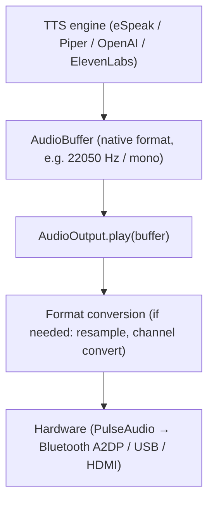
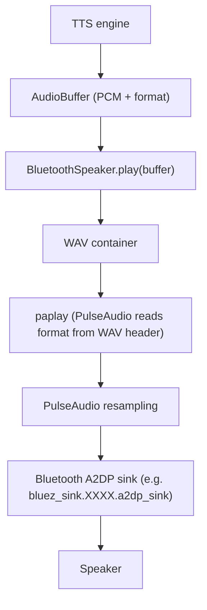

# Audio Architecture

DeskBot uses an **explicit audio-format contract** that separates audio
*generation* (TTS engines) from audio *playback* (output devices).

## Audio contract

All audio flowing through DeskBot is wrapped in an `AudioBuffer` that
carries its format metadata:

```python
@dataclass
class AudioBuffer:
    pcm: bytes           # raw signed 16-bit little-endian PCM
    sample_rate: int     # Hz (e.g. 22050, 24000, 44100, 48000)
    channels: int        # 1 = mono, 2 = stereo
    sample_format: str   # "s16le" (currently the only supported format)
```

This means every TTS engine reports its **actual** output format, and
every output device knows exactly what it receives. No format guessing.

## Flow



## TTS providers and their native formats

| Provider  | Sample rate | Channels | Notes |
|-----------|-------------|----------|-------|
| eSpeak-NG | 22050 Hz    | 1 (mono) | Read from WAV header |
| Piper     | 22050 Hz    | 1 (mono) | Model-dependent, read from chunk |
| OpenAI    | 24000 Hz    | 1 (mono) | `response_format=pcm` |
| ElevenLabs| 16000 Hz    | 1 (mono) | `output_format=pcm_16000` |

## Output devices

### Bluetooth speaker (PulseAudio)

The `BluetoothSpeaker` wraps the `AudioBuffer` in a WAV container and
passes it to `paplay`. PulseAudio reads the WAV header and performs
correct resampling to the sink's negotiated format (e.g. 44100 Hz stereo).

No format flags (`--raw`, `--rate`, `--channels`, `--format`) are passed
to `paplay`. The WAV header carries the format.

### USB speaker (PortAudio)

The `UsbSpeaker` converts s16le to float32 and plays at the buffer's
own sample rate. PortAudio handles resampling to the device's native rate.

## PulseAudio (not PipeWire)

DeskBot intentionally uses **standalone PulseAudio** rather than
PipeWire/WirePlumber for Bluetooth audio. The installer
(`scripts/install.sh`):

1. Installs `pulseaudio`, `pulseaudio-utils`, `pulseaudio-module-bluetooth`
2. Disables and masks PipeWire/WirePlumber services and sockets
3. Configures PulseAudio with Bluetooth module support
4. Enables user lingering for the service user

The working audio path:



## Laptop configuration (Arch Linux / PipeWire)

On a laptop with ALSA/PipeWire, the recommended configuration is:

```bash
# .env
DESKBOT_HARDWARE=real
DESKBOT_AUDIO__BACKEND=usb
DESKBOT_AUDIO__OUTPUT_DEVICE=default
DESKBOT_MICROPHONE__INPUT_DEVICE=default
DESKBOT_MICROPHONE__CHANNELS=1
DESKBOT_TTS__PROVIDER=espeak   # or piper, openai, elevenlabs
```

### Verifying the microphone

```bash
deskbot-doctor --microphone
```

This will:

1. Enumerate all available input devices
2. Show the PortAudio default input device
3. Show which device DeskBot would select
4. Open the device and capture a short sample
5. Report whether non-zero audio is being received
6. Report RMS / min / max / overflow statistics

If the diagnostic reports `Non-zero audio: False`, check:

- The default input device is correct (`wpctl status` on PipeWire)
- The microphone is not muted (`wpctl set-volume ...` or `alsamixer`)
- The correct device is selected (try a numeric index from the
  enumeration, but note that indexes are not stable across reboots)

### Verifying the speaker

```bash
deskbot-doctor --audio
```

This plays a short test tone through the configured audio backend. If
the backend is `mock`, it reports that no physical playback will occur.

### Device selection

- `"default"` — uses PortAudio's default input/output device. This is
  the recommended setting for laptops with a correctly configured
  default audio device.
- Numeric index — use a specific PortAudio device index. Device indexes
  are **not stable** across reboots or ALSA configuration changes.
- Name substring — match a device by case-insensitive name substring
  (e.g. `"USB Headset"`).

Do **not** assume device index `0` is universally correct. Use
`deskbot-doctor --microphone` to determine the correct device.

## Troubleshooting

### Check PulseAudio is running

```bash
pactl info
```

### List available sinks

```bash
pactl list short sinks
```

### Check the default sink

```bash
pactl get-default-sink
```

### Test playback directly

```bash
espeak-ng -v en -w /tmp/test.wav "my name is ROB"
paplay /tmp/test.wav
```

### Select a specific sink

```bash
paplay --device=<sink-name> /tmp/test.wav
```

### Bluetooth speaker not appearing

1. Ensure the speaker is paired: `bluetoothctl paired-devices`
2. Connect: `bluetoothctl connect <MAC>`
3. Check PulseAudio sees it: `pactl list short sinks`
4. Look for a sink named `bluez_sink.<device>.a2dp_sink`

### PipeWire conflicts

If `pipewire-pulse` is running, it can intercept the PulseAudio socket:

```bash
# Check which process is serving the PulseAudio socket
pactl info | grep "Server Name"
# Should say "PulseAudio" not "PulseAudio (on PipeWire)"
```

If PipeWire is active, rerun the installer or:
```bash
systemctl --user mask pipewire pipewire-pulse wireplumber
systemctl --user mask pipewire.socket pipewire-pulse.socket
```
