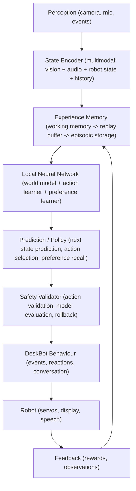

# DeskBot Learning Architecture

## Overview

DeskBot's local learning system enables the robot to observe its environment, record experience, learn measurable
relationships from that experience, retain what it learned, and safely use the learned knowledge to improve behaviour —
all running on-device with no external inference APIs or pretrained models.

> **Production hardening:** The learning system has been re-architected with
> transition lifecycle semantics, typed observations, deterministic encoding,
> frozen evaluation datasets, shadow-mode policy inference, safety-gated
> actions, canary model deployment, and controlled online learning.
> See [Production Learning System](production-learning.md) for the full
> phased rollout documentation.

## Data Flow

## Components

### Phase 1–2: Foundation

- **Tensor / Network / MLP** — Minimal neural-network framework built from scratch
- **Experience Memory** — WorkingMemory (ring buffer) -> ReplayBuffer (random access) -> EpisodicMemory (SQLite
  persistence)

### Phase 3: State Encoder

- **StateEncoder** — Deterministic, fixed-size vector (91 elements) from robot state, emotions, servos, vision, audio,
  personality, flags, rewards, and the teaching/gesture/conversation context block (`ENCODER_VERSION = 2`). Slots
  `[51..61)` carry `teaching_context`, `interaction_active`, `person_present`, a 5-way gesture one-hot,
  `conversation_turn`, and `last_action_index`; `[61..90)` remains reserved. Teaching is a context flag, not a
  `RobotState`, to preserve the 8-wide state one-hot and the 570-dim multimodal vector.
- **VisionFeatures** / **AudioFeatures** — Structured feature extraction from face detection and PCM audio

### Phase 4: World Model

- **WorldModel** — MLP that predicts next_state from (state, action); trained on experience replay
- **SimpleEnvironment** — 2-D simulation for testing prediction learning

### Phase 5: Action Learning

- **ActionLearner** — Q-learning with function approximation; epsilon-greedy exploration. Trained each background
  training cycle on feedback-amended rewards (`reward_for_transition`), so Q-values move toward demonstrated and praised
  actions over repetitions.
- **ActionSpace** — Registry of 16 valid DeskBot actions: the 10 original gaze/blink/celebrate/sleep actions plus
  learnable `speak`, `change_emotion`, `set_state`, `wave`, `move_left_arm`, `move_right_arm`. A reverse
  `action_index -> BehaviorAction` mapping resolves an index back to a concrete action for execution.
- **ActionLearningEnv** — Simulation environment with reward structure

### Phase 6: Continual Learning

- **LearningService** — Background daemon thread that:
    - Subscribes to the event bus via ExperienceRecorder
    - Collects experiences in replay buffer
    - Trains candidate model in background (never blocks main loop)
    - Evaluates candidate vs current model
    - Promotes or rolls back based on evaluation
    - Saves checkpoints for recovery
- **LearningSchedule** — Configurable: train every N experiences, minimum interval
- **ResourceLimits** — Configurable: CPU fraction, batch size, epochs, model size
- **CheckpointConfig** — Configurable: directory, keep_last_n, promote_threshold

### Phase 7: Multimodal Learning — **Production integrated**

- **VisionEncoder** — Trainable MLP (6->32->16->16) encoding face detection features
- **AudioEncoder** — Trainable MLP (3->16->8->8) encoding audio signal features
- **HistoryBuffer** — Ring buffer of recent state vectors for temporal context
- **MultimodalEncoder** — Concatenates robot_state (91) + vision_encoded (16) + audio_encoded (8) + history (91×5) = 570
  elements
- **MultimodalEnvironment** — Simulation where vision, audio, and both together give different reward signals
- **Production wiring** — Enabled via `DESKBOT_LEARNING__USE_MULTIMODAL=true`; the `LearningService` creates a
  `MultimodalEncoder`, uses `multimodal_size()` for the world model and action learner state sizes, and trains the
  sub-encoders in each background training cycle via self-supervised reconstruction
- **Sub-encoder training** — Each training cycle trains the vision and audio sub-encoders with a reconstruction
  objective (encode → reconstruct input), giving the world model richer features without end-to-end backprop

### Phase 8: Preference Learning

- **PreferenceLearner** — Observes recurring patterns with confidence scores
    - Confidence increases with repeated observations
    - Confidence decays over time without reinforcement
    - Explicit observations boost more than inferred
    - Never infers sensitive personal attributes
- **LearnedPreference** — Category/value pairs with confidence, observation count, avg reward
- **Persistence** — Via existing PreferenceStore (in-memory or SQLite)

### Phase 9: Safety, Evaluation & Rollback

- **ModelEvaluator** — Compares candidate vs current model on fixed evaluation set
- **EvaluationThresholds** — Configurable: min_improvement_ratio, max_loss, max_latency, max_prediction_std
- **ActionSafetyValidator** — Blocks invalid/unsafe actions (unknown names, out-of-range params, rate limits)
- **LearningSafetyManager** — Coordinates evaluation, validation, and checkpoint management
- **Graceful degradation** — Corrupted checkpoints, bad candidates, training exceptions, missing sensors all handled
  without crashing the robot

### Phase 10: Production Integration

- **Configuration** — All learning parameters configurable via environment variables (DESKBOT_LEARNING__*)
- **CLI** — `deskbot-learning-status`, `deskbot-learning-train`, `deskbot-learning-evaluate`, `deskbot-learning-reset`,
  `deskbot-learning-export`
- **REST API** — `/api/v1/learning/status`, `/api/v1/learning/preferences`, `/api/v1/learning/config`,
  `/api/v1/learning/train`
- **Event Bus Integration** — LearningService subscribes to events via ExperienceRecorder
- **Lifecycle** — Learning starts/stops with the app; failures are isolated

## Teaching & human feedback

When `DESKBOT_TEACHING__ENABLED=true` (requires learning enabled), a human-in-the-loop teaching loop layers on top of
the action learner so the robot learns by demonstration and real spoken feedback:

- **TeachingController** — arms a session from a constrained spoken instruction (`"when I wave, wave back"`) via the
  `parse_teaching_instruction`
  parser (no LLM), then on a matching `GestureDetected` event runs **demonstrate**
  (execute the human-specified action) or **practice** (let the policy propose)
  mode. Below `min_experiences_for_practice`, practice falls back to demonstration.
- **FeedbackLedger / FeedbackService** — post-hoc, last-wins, recency-gated human feedback (praise/correction)
  attributed to the most-recent eligible real transition. Feedback is never invented.
- **RewardModel** — a `human_feedback_reward` component plus
  `LearningService.reward_for_transition` (recorded reward + post-hoc ledger delta), so the action learner trains on the
  amended reward.
- **SafetyGate** — a **non-mutating** `is_valid` check runs inside
  `select_action`'s candidate loop; the single chosen action is re-validated with the full mutating `validate`
  immediately before execution.

Teaching is a **context flag on the state vector, not a `RobotState`**, so
`STATE_SIZE` stays 91 and the multimodal vector stays 570. Observability is via
`/api/v1/teaching/*` and the `/teaching` dashboard. See
[Teaching Mode](../modules/teaching_mode.md) for the full loop; teaching parameters use the `DESKBOT_TEACHING__*` prefix
(see `.env.example`).

## Configuration

All learning parameters are configurable via `DESKBOT_LEARNING__*` environment variables:

| Variable                                      | Default                  | Description                             |
|-----------------------------------------------|--------------------------|-----------------------------------------|
| `DESKBOT_LEARNING__ENABLED`                   | `false`                  | Enable/disable the learning system      |
| `DESKBOT_LEARNING__MIN_NEW_EXPERIENCES`       | `32`                     | Min new experiences before training     |
| `DESKBOT_LEARNING__TRAIN_INTERVAL_S`          | `30.0`                   | Min seconds between training cycles     |
| `DESKBOT_LEARNING__BATCH_SIZE`                | `32`                     | Mini-batch size                         |
| `DESKBOT_LEARNING__TRAINING_EPOCHS_PER_CYCLE` | `5`                      | Epochs per training cycle               |
| `DESKBOT_LEARNING__MAX_CPU_FRACTION`          | `0.3`                    | Target CPU fraction for training thread |
| `DESKBOT_LEARNING__PROMOTE_THRESHOLD`         | `1.0`                    | Candidate must be this factor better    |
| `DESKBOT_LEARNING__CHECKPOINT_DIR`            | `~/.deskbot/checkpoints` | Model checkpoint directory              |
| `DESKBOT_LEARNING__KEEP_LAST_N_CHECKPOINTS`   | `5`                      | Checkpoints to keep on disk             |
| `DESKBOT_LEARNING__USE_MULTIMODAL`            | `false`                  | Enable trainable multimodal encoder     |
| `DESKBOT_LEARNING__MULTIMODAL_HISTORY_LENGTH` | `5`                      | Temporal history snapshots (0 = none)   |

## Design Principles

1. **Local-only** — No external AI services, pretrained models, or cloud APIs
2. **Non-blocking** — Training runs in a daemon thread, never blocks the main event loop
3. **Safe** — Candidates are evaluated before promotion; rollback is immediate
4. **Observable** — Status, configuration, and preferences accessible via API
5. **Configurable** — All parameters tunable via environment variables
6. **Graceful degradation** — Learning failures never crash the robot
