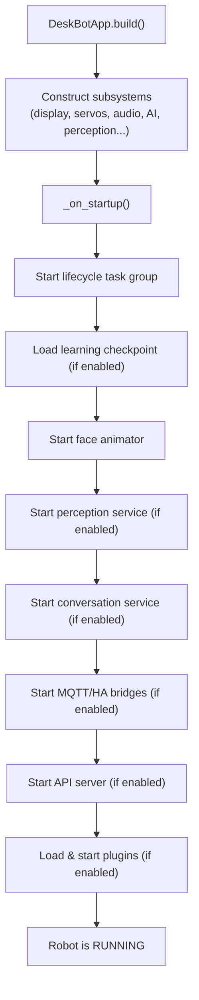
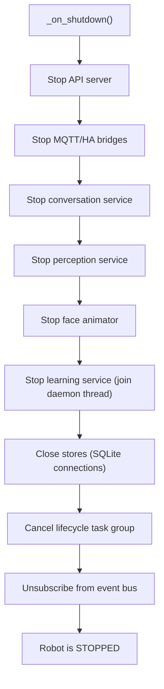
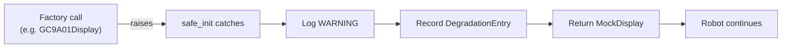

# Lifecycle architecture

DeskBot's lifecycle management ensures the application starts and stops
cleanly, and that hardware failures never crash the robot.

---

## Startup sequence

`DeskBotApp.build()` constructs all subsystems, then `_on_startup()` runs
the ordered startup hooks:

Every step is wrapped in defensive `try`/`except` (via `contextlib.suppress`
or `safe_init`). If a component fails to start, the robot continues with a
mock or no-op fallback — it never crashes.

---

## Shutdown sequence

`_on_shutdown()` runs shutdown hooks in reverse order:

Shutdown is idempotent — calling it twice is safe. All background tasks are
cancelled and joined before the process exits.

---

## Graceful degradation

The degradation system is the robot's resilience mechanism. When a hardware
backend fails to initialise, `safe_init()` catches the exception, logs a
`WARNING`, records a `DegradationEntry`, and returns a mock fallback.

### How it works

### Components with fallbacks

| Component | Fallback | When |
|-----------|----------|------|
| Display | `MockDisplay` | GC9A01/CircuitPython init fails |
| Servos | `MockServoBus` | GPIO/PCA9685 init fails |
| Audio output | `MockAudioOutput` | USB/Bluetooth init fails |
| Microphone | (None — disabled) | USB microphone init fails |
| Camera | `MockCamera` | USB camera init fails |
| LLM | `MockLLM` | OpenAI/Ollama connection fails |
| STT | `MockSTT` | Whisper init fails |
| TTS | `MockTTS` | Provider init fails |
| Wake word | `NullWakeWordChecker` | Provider dependency missing |

### Health monitoring

The `GET /api/v1/health` endpoint returns the overall status (`"ok"` or
`"degraded"`) and per-component degradation details, so external monitoring
tools can detect when the robot is running with fallback hardware.

---

## Lifecycle states

The `Lifecycle` manager transitions through these states:

| State | Description |
|-------|-------------|
| `NEW` | Not yet started |
| `STARTING` | Startup hooks are running |
| `RUNNING` | All startup hooks complete; task group active |
| `STOPPING` | Shutdown hooks are running |
| `STOPPED` | All shutdown hooks complete; resources released |

The lifecycle owns the root `anyio` task group. Components subscribe to the
event bus during startup and unsubscribe during shutdown — the manager
guarantees both happen exactly once.
