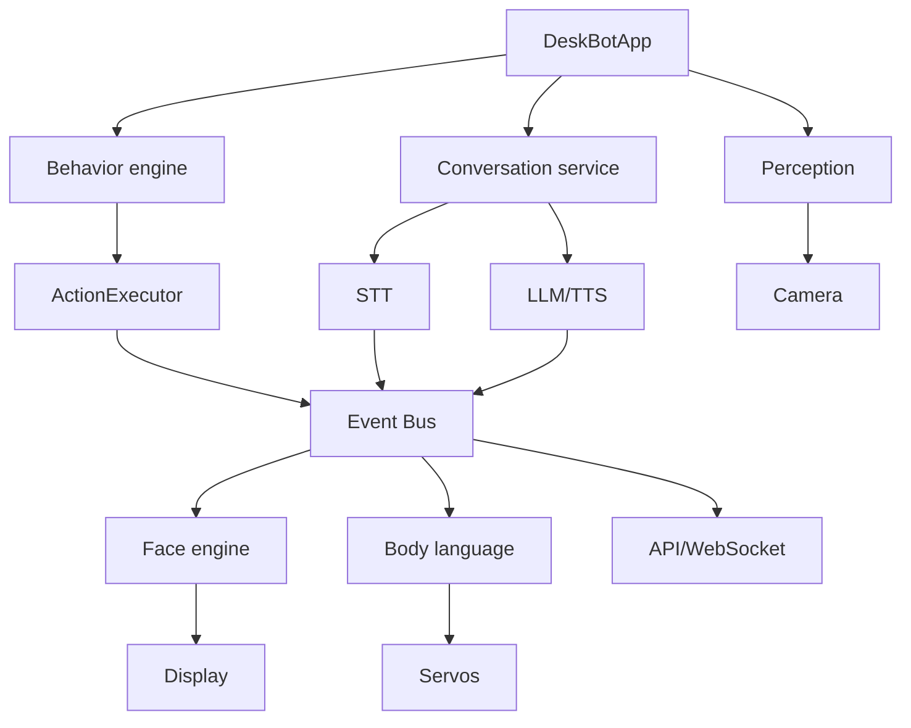
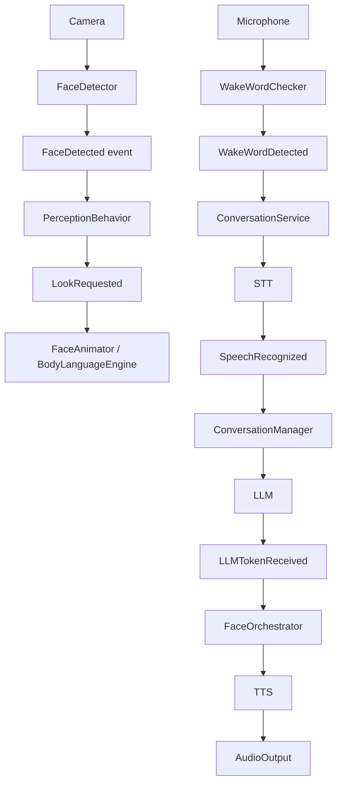

# Architecture overview

DeskBot is an asynchronous, event-driven application with explicit interfaces
between application logic and hardware/provider implementations.

The main composition root is `robot.app.DeskBotApp`. Configuration is loaded
through `robot.config.AppSettings`, dependencies are constructed at startup,
and long-running services share an `InMemoryEventBus`.

## System view



The event bus is the main decoupling mechanism. Components publish immutable
dataclass events and subscribe to the event types they understand.

## Major packages

```text
src/robot/
├── ai/                 LLMs, conversations, persistence, memory, tools
├── animation/          easings, timelines, scheduler
├── api/                FastAPI routes, state bridge, WebSocket stream
├── behavior/            state machine, idle behavior, reactions
├── behavior_library/   reusable high-level behaviors
├── body_language/      servo choreography and poses
├── cli/                command-line entry points
├── events/             event bus and event payloads
├── face/               face model, renderer, emotions, themes, animation
├── eye_engine/         legacy eye-only implementation
├── hardware/           displays, servos, audio, camera, microphone
├── interfaces/         Protocol-based hardware/provider contracts
├── perception/         camera scanning and face detection
├── plugins/            entry-point plugin lifecycle
├── services/           conversation service, executor, MQTT/HA bridges
├── simulation/         headless face/body simulation
└── speech/             STT, TTS, wake-word detection, sound effects
```

## Hardware abstraction

Application code depends on protocols such as `Display`, `ServoController`,
`AudioOutput`, `Microphone`, `Camera`, `LLM`, and `StreamingLLM`.

Concrete implementations are selected by configuration.

| Concern | Implementations |
|---|---|
| Display | mock, GC9A01 SPI, CircuitPython/displayio |
| Servos | mock, Raspberry Pi GPIO, PCA9685 |
| Camera | mock, USB camera |
| Microphone | mock, USB microphone |
| Audio output | mock, USB speaker, Bluetooth speaker |
| LLM | mock, OpenAI, Ollama |
| STT | mock, Whisper, reserved Vosk/Google configuration values |
| TTS | mock, OpenAI, Piper, eSpeak-NG, ElevenLabs |
| Wake word | mock, openWakeWord, reserved Porcupine/Snowboy values |

Factories fail fast when a configured real backend cannot be initialized. The
application does not silently switch to another backend.

## Lifecycle

The application starts its configured services and publishes lifecycle events.
Shutdown cancels background tasks and closes provider/hardware resources.

Long-running components include the face animator, perception service,
conversation service, behavior tasks, and optional API/network bridges.

## Data flow

A typical interaction looks like:



The exact path depends on enabled services and providers.

## Testing strategy

The repository deliberately provides mock hardware and provider implementations.
Unit tests therefore do not require a Raspberry Pi.

- `tests/unit/` tests individual components.
- `tests/integration/` exercises subsystem interactions.
- Fake transports and providers isolate hardware boundaries.
- Simulation provides a visual, headless representation of face and body state.

## Extension rule

When adding hardware or a provider:

1. Define or reuse a protocol in `robot.interfaces`.
2. Implement the concrete backend under `robot.hardware`, `robot.ai`, or
   `robot.speech` as appropriate.
3. Register it in the corresponding factory.
4. Add configuration fields.
5. Add unit tests with fakes/mocks.
6. Document the backend and its limitations.

Application behavior should not need to know which concrete hardware driver is
active.
