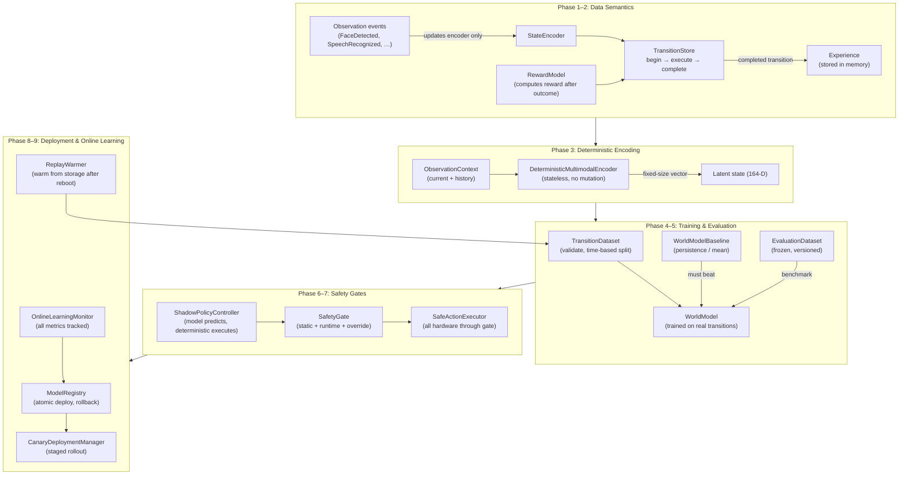

# Production Learning System

DeskBot's learning system has been re-architected into a **production-safe learning pipeline** that follows a strict
phased rollout. The system turns experimental learning code into a robust, auditable, and reversible infrastructure
where a learned policy can only influence hardware after every safety, data, and evaluation gate has been satisfied.

> The original learning architecture (neural-network core, experience
> memory, world model, action learning, multimodal encoding, preference
> learning, and the background training service) is documented in
> [Learning Architecture](learning.md). This document covers the
> **production hardening** layers built on top of that foundation.
>
> **Multimodal encoding is now production-integrated.** Enable with
> `DESKBOT_LEARNING__USE_MULTIMODAL=true` to use trainable vision/audio
> sub-encoders + temporal history for richer state vectors. The
> `LearningService` automatically adjusts the world model and action
> learner state sizes and trains the sub-encoders in each cycle.

## Design philosophy

1. **Fix data before training.**  A model trained on garbage is garbage. Phases 1–2 fix transition semantics and
   separate observations from actions before any model is trained.
2. **Determinism is non-negotiable.**  The same input must always produce the same output. Phase 3 makes the multimodal
   encoder stateless and deterministic.
3. **Beat the baseline or don't ship.**  Phase 4 requires every candidate model to beat a trivial persistence baseline
   on a frozen test set.
4. **Frozen evaluation.**  Phase 5 creates a permanent, versioned benchmark. If the evaluation data changes every run,
   you cannot tell whether the model improved.
5. **Shadow before active.**  Phase 6 runs the learned policy in shadow mode with zero hardware authority. The policy
   must prove itself in inference before it is allowed to act.
6. **Safety is architectural, not optional.**  Phase 7 makes it *impossible* for a learned policy to bypass safety
   validation. Every hardware action goes through the same gate.
7. **Deploy gradually, rollback instantly.**  Phase 8 introduces atomic model deployment with canary stages and
   single-operation rollback.
8. **Learn continuously, safely.**  Phase 9 allows production data to update the learning system — but only after all
   prior gates are in place.

## Pipeline overview



---

## Phase 1: Transition Semantics

**Goal:** Make every stored experience represent a real physical transition:
`state → action → physical outcome → next_state → reward`.

**Problem solved:** The previous `ExperienceRecorder` could encode a state and immediately encode another state without
an action being executed, creating fake transitions. Observation events (`FaceDetected`, `SpeechRecognized`, etc.) were
treated as actions.

### Transition lifecycle

```python
from robot.learning import TransitionStore, deskbot_action_space

store = TransitionStore(action_space=deskbot_action_space())

# OBSERVE state_t
state_t = encoder.encode()

# SELECT + EXECUTE action
pending = store.begin(state=state_t, action_index=2)  # look_center

# ... robot executes the action ...

# OBSERVE state_t+1 and compute reward
transition = pending.complete(
    next_state=state_t1,
    reward=0.5,
    done=False,
)
```

Until `complete()` is called, **no experience is persisted**.

### Key components

| Component            | File            | Purpose                                                   |
|----------------------|-----------------|-----------------------------------------------------------|
| `TransitionStore`    | `transition.py` | Manages begin/complete lifecycle with validation          |
| `PendingTransition`  | `transition.py` | An open transition awaiting completion                    |
| `Transition`         | `transition.py` | A completed, immutable transition with execution metadata |
| `ExperienceRecorder` | `recorder.py`   | Event-bus bridge; observation events update encoder only  |

### Execution metadata

Every transition records:

- `transition_id` — unique identifier
- `execution_id` — hardware execution identifier
- `action_index`, `action_name`, `action_vector` — action identity from ActionSpace
- `start_timestamp_ns`, `completion_timestamp_ns` — monotonic timestamps
- `execution_success`, `execution_failure_reason` — success/failure
- `latency_ms` — wall-clock latency between begin and complete
- `policy_version` — version of the policy that selected the action

### Tests

- No action → no completed transition
- Failed action execution recorded with `execution_success=False`
- `next_state` captured after execution
- Action ID belongs to the configured action space
- Timestamps are monotonic
- Malformed transitions (NaN, inf, empty, invalid index) rejected

---

## Phase 2: Observation, Action, Reward Separation

**Goal:** Stop mixing what the robot *observes* with what it *does*.

### Typed observations

```python
from robot.learning import Observation, RobotObservation, VisionObservation, AudioObservation

# Capture an observation snapshot from the encoder
obs = Observation.from_encoder(encoder)

# An observation contains:
#   obs.robot    — emotions, state, personality, servos, idle_seconds
#   obs.vision   — face detection results (VisionFeatures)
#   obs.audio    — audio signal features (AudioFeatures)
#   obs.timestamp_ns — when the observation was taken
```

**Observations** are: `FaceDetected`, `SpeechRecognized`, audio level, face confidence, sensor state, user presence.

**Actions** are the 16 entries in `deskbot_action_space()`: the original `look_left`, `look_right`, `look_center`, `look_up`, `look_down`, `blink`, `wink`, `celebrate`, `sleep`, `look_around` (indices 0-9) plus the learnable interaction actions `speak`, `change_emotion`, `set_state`, `wave`, `move_left_arm`, `move_right_arm` (indices 10-15). A reverse `action_index -> BehaviorAction` mapping resolves an index back to the executable behaviour.

Never is `FaceDetected` encoded as an action.

### Reward model

Reward calculation is moved out of the recorder into a configurable
`RewardModel`:

```python
from robot.learning import RewardModel

model = RewardModel()
reward = model.compute(
    observation=obs_before,
    action=action,
    next_observation=obs_after,
)
```

Reward components are pluggable:

| Component | Reward |
|-----------|--------|
| `face_engagement_reward` | +0.1 for engaging with a detected face |
| `idle_penalty_reward` | −0.5 for sleeping with stimuli present |
| `interaction_reward` | +0.05 for interacting with a face |
| `human_feedback_reward` | post-hoc human praise/correction (±polarity·magnitude), clamped to [-1, 1] |

`LearningService.reward_for_transition(transition_id)` returns the **recorded**
reward (which already includes the immediate `human_feedback_reward` component)
**plus** the post-hoc `FeedbackLedger` delta, clamped to [-2, 2] (and `0.0`
when the transition is no longer in `working_memory.recent(256)`; the
`staleness_s` bound is defined but not currently enforced). This amended reward
is what the action learner trains on — see the
[teaching loop](#teaching-loop).

### No future leakage

The `recent_rewards` tuple in `RobotObservation` contains only **past**
rewards. The reward for the transition being recorded is computed *after* the outcome is observed and is never part of
the observation.

### Tests

- Every action is valid (from ActionSpace)
- Observations contain no future reward
- Events are mapped to observations, not actions
- Reward is calculated after the outcome
- Serialization round-trips correctly

---

## Phase 3: Deterministic Multimodal Encoding

**Goal:** Turn the multimodal encoder into a reproducible representation function. The same input must always produce
the same output.

**Problem solved:** The previous `MultimodalEncoder` mutated its internal history buffer on every `encode()` call,
making consecutive calls produce different outputs even for the same observation.

### Current wiring vs. design

> **As wired today**, `DESKBOT_LEARNING__USE_MULTIMODAL=true` enables the
> **570-D trainable `MultimodalEncoder`** (robot state 91 + vision 16 + audio 8
> + history 91×5), with trainable vision/audio sub-encoders and self-supervised
>   reconstruction — see
>   [Learning > Part 7](../modules/learning.md). The stateless
>   `DeterministicMultimodalEncoder` (164-D) described below is the intended
>   production design: it shares the deterministic-feature / no-future-leakage
>   principle but is **not yet wired into `LearningService`**. The two differ in
>   dimensionality and trainability; treat this phase as the design target, not
>   the running code path.

### Current wiring vs. design

> **As wired today**, `DESKBOT_LEARNING__USE_MULTIMODAL=true` enables the
> **570-D trainable `MultimodalEncoder`** (robot state 91 + vision 16 + audio 8
> + history 91×5), with trainable vision/audio sub-encoders and self-supervised
> reconstruction — see
> [Learning > Part 7](../modules/learning.md). The stateless
> `DeterministicMultimodalEncoder` (164-D) described below is the intended
> production design: it shares the deterministic-feature / no-future-leakage
> principle but is **not yet wired into `LearningService`**. The two differ in
> dimensionality and trainability; treat this phase as the design target, not
> the running code path.

### Stateless design

```python
from robot.learning import DeterministicMultimodalEncoder, ObservationContext

encoder = DeterministicMultimodalEncoder(history_length=5)

# History management is OUTSIDE the encoder
context = ObservationContext(
    current=observation,
    history=past_observations,
)

# Same context → identical output, every time
vec = encoder.encode(context)  # 164-D vector
```

The encoder has **no mutable state**. Calling `encode()` 10,000 times on the same context produces byte-identical
results.

### Architecture

```
Vision features (normalised, 6-D)
      |
Audio features (normalised, 3-D)
      |
Robot state (deterministic, 91-D)
      |
      v
Concatenation (100-D)
      |
      v
Temporal encoder (fixed-seed MLP over history, 64-D)
      |
      v
Latent state (164-D)
```

No transformers. No pretrained models. No trainable modality encoders. Deterministic feature normalisation only.

### Tests

- Same input → identical output (10,000 encodings)
- No NaN, no inf
- Fixed output dimension (164)
- History ordering matters
- Empty and full history handled
- Stateless — no reset needed
- Version compatibility

---

## Phase 4: World Model Training on Real Transitions

**Goal:** Train the world model using valid physical transitions.

### Transition validation

The `TransitionDataset` validates every transition before training:

| Rejection reason      | Check                                                      |
|-----------------------|------------------------------------------------------------|
| Missing next state    | `next_state` is non-empty                                  |
| Missing action        | `action` vector is non-empty                               |
| Invalid action        | `action_index` in ActionSpace range                        |
| NaN/inf               | All values in state, action, next_state, reward are finite |
| Impossible timestamps | `completion_ns >= start_ns`                                |

### Time-based splitting

Data is split **temporally** (not randomly) to prevent leakage of near-identical consecutive samples:

```
earliest 70% → train
middle 15%  → validation
latest 15%  → test
```

Episode-based splitting (by `metadata["episode"]`) is also supported.

### Baseline

A trivial `WorldModelBaseline` must be beaten:

| Strategy      | Prediction                                  |
|---------------|---------------------------------------------|
| `persistence` | `next_state = current_state`                |
| `mean`        | `next_state = mean of training next_states` |
| `zero`        | `next_state = zeros`                        |

The learned model must not be promoted unless it beats the baseline on the frozen test set.

### Reproducibility

```
dataset version + code commit + hyperparameters = same evaluation result
```

---

## Phase 5: Frozen Evaluation Dataset

**Goal:** Create a permanent benchmark that every candidate model must pass. If the evaluation data changes every run,
you cannot tell whether the model improved.

### Standard scenarios (14)

| #  | Scenario               | Expected behaviour          |
|----|------------------------|-----------------------------|
| 1  | face_present_silence   | Engage — do not sleep       |
| 2  | face_present_speech    | Full interaction            |
| 3  | no_face_speech         | Look around to find speaker |
| 4  | no_face_silence        | Conserve energy             |
| 5  | moving_face            | Track the face              |
| 6  | multiple_faces         | Look at primary face        |
| 7  | low_confidence_face    | Look around to confirm      |
| 8  | high_audio_energy      | Find the source             |
| 9  | low_audio_energy       | Conserve energy             |
| 10 | camera_dropout         | Rely on audio               |
| 11 | microphone_dropout     | Rely on vision              |
| 12 | malformed_sensor_input | Safe fallback               |
| 13 | idle_state             | Sleep                       |
| 14 | interaction_state      | Engage actively             |

Each scenario defines: valid actions, preferred actions, forbidden actions, and expected safety behaviour.

### Promotion rule

A candidate must not be promoted unless:

```
safety violations == 0
invalid actions == 0
NaN/inf == 0
latency within limit
world model >= baseline
policy performance >= baseline
```

### Determinism

The same candidate evaluated twice gets the same result. The benchmark is immutable once versioned.

---

## Phase 6: Shadow-Mode Policy

**Goal:** Run the learned policy against live observations without allowing it to control the robot.

### Modes

| Mode     | Behaviour                                          |
|----------|----------------------------------------------------|
| `off`    | No learned inference                               |
| `shadow` | Model predicts, deterministic controller executes  |
| `assist` | Model may suggest, deterministic logic can reject  |
| `active` | Only approved actions controlled by learned policy |

### Shadow logging

Every decision logs: timestamp, observation ID, deterministic action, model action, model scores, model version, safety
result, inference latency, agreement flag.

### Zero authority

```python
learned_action = policy.predict(observation)
# DO NOT execute learned_action
actual_action = deterministic_controller.select(observation)
executor.execute(actual_action)
```

The model was active in inference but had **zero authority** to execute hardware actions.

---

## Phase 7: Safety-Gated Actions

**Goal:** Make it impossible for a learned policy to bypass robot safety rules.

### Three layers

**Layer 1 — Static validation:**

- Action exists in ActionSpace
- Parameters valid (servo limits, timing limits)
- Rate limits

**Layer 2 — Runtime safety:**

- Action cooldown
- Conflicting actions
- Robot state restrictions

**Layer 3 — Emergency override:**

- Reliable mechanism to disable learned control immediately
- When active, all actions fall back to deterministic

### No bypass

No HTTP endpoint, event handler, training component, or policy can bypass the `SafetyGate`. Every hardware action uses
the same execution path through `SafeActionExecutor`.

### Fallback handling

When the policy crashes, returns NaN, returns an invalid action, times out, or cannot load, the robot falls back to
deterministic behaviour. Never is the robot left without a valid controller.

---

## Phase 8: Canary Model Deployment

**Goal:** Deploy learned models gradually and reversibly.

### Model registry

Every model has metadata:

```json
{
  "model_version": 17,
  "schema_version": 3,
  "state_encoder_version": 2,
  "multimodal_version": 2,
  "action_space_version": 4,
  "git_commit": "...",
  "dataset_version": "...",
  "training_run": "...",
  "validation": {
    "loss": 0.0,
    "reward": 0.0,
    "safety_violations": 0,
    "latency_ms_p95": 0.0
  }
}
```

### Atomic deployment

1. Write model to a temp file.
2. Flush and fsync.
3. Atomically rename to the final path.
4. Update the active pointer.

Never is the active checkpoint overwritten directly.

### Canary stages

```
candidate → offline_evaluation → shadow → small_action_subset
         → limited_active → full_deployment
```

### Rollback

Rollback is a single operation. The previous known-good model is always retained.

### Startup validation

On startup: schema, dimensions, checksum, finite weights, action-space version, encoder version. If invalid, load the
previous known-good model.

---

## Phase 9: Controlled Online Learning

**Goal:** Allow production data to update the learning system — but only after all prior gates are in place.

### Separate processes

| Process            | Responsibilities                                 |
|--------------------|--------------------------------------------------|
| `robot.service`    | Perception, behaviour, inference, hardware       |
| `learning.service` | Replay, training, evaluation, candidate creation |

Training never starves the real-time control loop.

### Persistence

Persisted: experiences, training runs, model versions, evaluation results, safety events, policy decisions.

The replay buffer is warmed from persistent storage after reboot.

### Constrained exploration

**Never** use unrestricted epsilon-greedy exploration on the physical robot. Explore only in: simulation, offline
replay, shadow mode, or constrained action subsets.

### Monitoring

| Metric                     | Tracked by                                |
|----------------------------|-------------------------------------------|
| Model version              | `OnlineLearningMonitor`                   |
| Replay size                | `OnlineLearningMonitor`                   |
| Training rate              | `OnlineLearningMonitor`                   |
| Training / validation loss | `OnlineLearningMonitor`                   |
| Total reward               | `OnlineLearningMonitor`                   |
| Action distribution        | `OnlineLearningMonitor`                   |
| Safety rejections          | `OnlineLearningMonitor`                   |
| Fallback count             | `OnlineLearningMonitor`                   |
| Sensor dropout count       | `OnlineLearningMonitor`                   |
| Inference latency          | `OnlineLearningMonitor` + `ShadowMetrics` |
| Model load failures        | `OnlineLearningMonitor`                   |

---

## Module map (new files)

```
robot/learning/
├── transition.py            # Phase 1: TransitionStore lifecycle + validation
├── observation.py           # Phase 2: Typed Observation / RobotObservation / VisionObservation / AudioObservation
├── reward.py                # Phase 2: RewardModel with pluggable components
├── deterministic_encoder.py # Phase 3: Stateless DeterministicMultimodalEncoder + ObservationContext
├── dataset.py               # Phase 4: TransitionDataset (validate, time-based split) + WorldModelBaseline
├── evaluation.py            # Phase 5: EvaluationDataset (frozen, versioned) + PromotionRule
├── shadow_policy.py         # Phase 6: ShadowPolicyController (off/shadow/assist/active)
├── safety_gate.py           # Phase 7: SafetyGate (3-layer) + SafeActionExecutor
├── model_registry.py        # Phase 8: ModelRegistry (atomic deploy, rollback) + CanaryDeploymentManager
├── online_learning.py       # Phase 9: OnlineLearningMonitor + ConstrainedExploration + ReplayWarmer
├── action_mapping.py        # action_index -> BehaviorAction reverse mapping (16-action space)
├── teaching_parser.py       # constrained "when I {gesture}, {action}" instruction parser (no LLM)
├── teaching_controller.py   # demonstrate/practice teaching-loop driver
├── interaction_context.py  # interaction_id / teaching_session_id / episode_id tagging
├── feedback_ledger.py      # post-hoc human-feedback store (last-wins, never invented)
└── feedback_service.py     # attributes feedback to the most-recent eligible real transition
```

## Teaching loop

The **teaching mode** layers a human-in-the-loop on top of the action learner.
Gated by `DESKBOT_TEACHING__ENABLED=true` (requires learning enabled), it arms a
session from a constrained spoken instruction, demonstrates or practices on a
matching `GestureDetected` event, and attributes spoken/API praise/correction
to the most-recent eligible real transition via `FeedbackService` /
`FeedbackLedger`. The `ActionLearner` then trains on the feedback-amended
reward each cycle. Safety is preserved: practice proposals pass a non-mutating
`SafetyGate.is_valid` during selection and are re-validated with the full
mutating `validate` before execution. See
[Teaching Mode](../modules/teaching_mode.md) for the full loop.

## Production checklist

The learned policy remains disabled until every box is checked:

### Data

- [x] Every transition has state, action, next_state, reward
- [x] Action comes from ActionSpace
- [x] Events are observations, not actions
- [x] No future information leaks into state
- [x] Invalid transitions are rejected
- [x] Transitions survive reboot

### Encoding

- [x] Encoder is deterministic
- [x] Version is recorded
- [x] Dimensions are validated
- [x] NaN/inf are rejected
- [x] History semantics are tested

### Training

- [x] Train/validation/test split exists
- [x] Frozen evaluation dataset exists
- [x] Baseline exists
- [x] Training runs are reproducible
- [x] Candidate models have metadata

### Safety

- [x] Learned actions pass one safety validator
- [x] Hardware cannot be controlled directly by training
- [x] Invalid model output triggers fallback
- [x] Model timeout triggers fallback
- [x] Manual override works

### Deployment

- [x] Models are atomically loaded
- [x] Previous model is retained
- [x] Rollback works
- [x] Shadow mode works
- [x] Canary deployment works

### Observability

- [x] Model version logged
- [x] Policy decisions logged
- [x] Safety rejections logged
- [x] Inference latency measured
- [x] Training metrics measured
- [x] Crash/fallback counts measured

### Final gate

- [x] The learned policy remains disabled until every box above is checked
