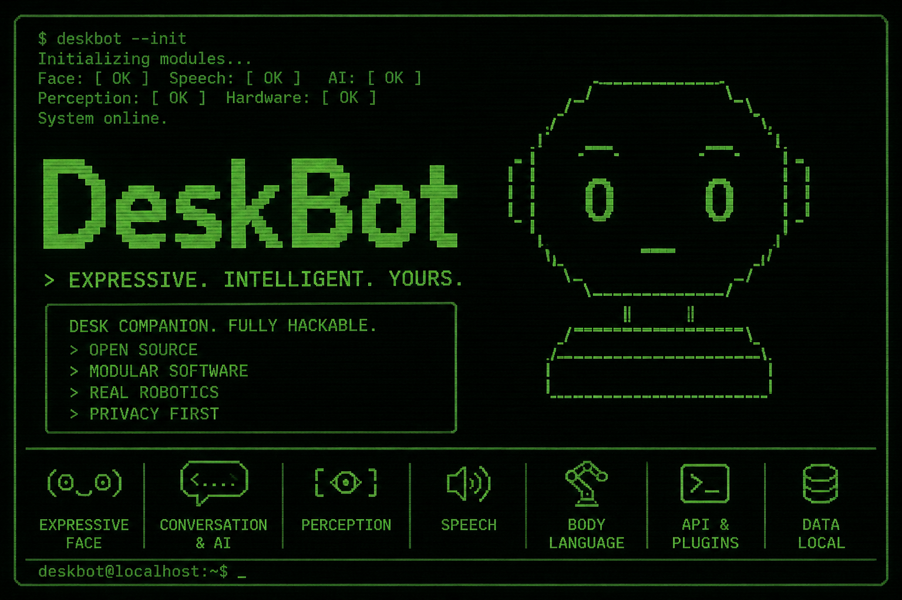

# DeskBot

**A modular desktop companion robot powered by Raspberry Pi.**

DeskBot is an asynchronous, event-driven Python application that brings a
small robot to life on your desk. It combines an animated face on a circular
TFT display, expressive servo-driven body language, camera-based perception,
speech recognition and synthesis, and a conversational AI stack - all
connected through an internal event bus.

{: .center}

---

## Quick start

```bash
# Clone the repository
git clone https://github.com/well-it-wasnt-me/deskbot.git
cd deskbot

# Create a virtual environment (Python 3.12+)
python -m venv .venv
source .venv/bin/activate

# Install with development dependencies
pip install -e ".[dev]"

# Run in simulation mode (no hardware needed)
deskbot simulate
```

See the [Developer Setup](developer-setup.md) guide for full instructions,
including hardware wiring and deployment.

## What's inside?

| Subsystem | Description |
|-----------|-------------|
| **Face engine** | Animated eyes, mouth, and expressions on a GC9A01 round display |
| **Body language** | Servo choreography for head pan/tilt and arm gestures |
| **Behavior engine** | State machine (idle -> curious -> listening -> thinking -> speaking) |
| **Perception** | YuNet face detection via USB camera |
| **Speech** | Whisper STT, Piper/eSpeak/OpenAI TTS, wake-word detection |
| **Conversation** | Ollama or OpenAI LLM with streaming, tools, and persistence |
| **Preferences** | Learns user name, volume, pace, formality, humour, and more |
| **REST API** | FastAPI server with WebSocket event streaming |
| **MQTT bridge** | Publishes events and receives commands over MQTT |
| **Home Assistant** | MQTT Auto Discovery for native HA integration |
| **Plugin system** | Extend DeskBot via Python entry points |

## Architecture

DeskBot uses a central **event bus** to decouple subsystems. Components
publish immutable dataclass events and subscribe to the event types they
care about. Hardware is abstracted behind protocol interfaces so the
same application code runs on a Pi or in simulation.

Read the full [Architecture Overview](architecture/overview.md).

## Documentation

- **Getting Started**: [Developer Setup](developer-setup.md) · [Wiring Guide](wiring.md) · [Deployment](deployment.md)
- **Core Modules**: [Face](modules/face.md) · [Body Language](modules/body_language.md) · [Behavior](modules/behavior.md) · [Animation](modules/animation.md) · [Events](modules/events.md)
- **Intelligence**: [Conversation & AI](modules/ai.md) · [Speech](modules/speech.md) · [Tools](modules/tools.md) · [Preferences](modules/preferences.md) · [Vector Memory](modules/vector_memory.md)
- **Integrations**: [Plugins](modules/plugins.md) · [MQTT Bridge](modules/mqtt.md) · [Home Assistant](modules/home_assistant.md) · [Face Animations](modules/animations.md)
- **Reference**: [Config](reference/config.md) · [Events](reference/events.md) · [Errors](reference/errors.md) · [REST API](reference/api.md) · [Hardware](reference/hardware.md)

## Contributing

We welcome contributions! See [Contributing](contributing.md) for guidelines.

## License

DeskBot is released under the [MIT License](https://github.com/well-it-wasnt-me/deskbot/blob/main/LICENSE).
