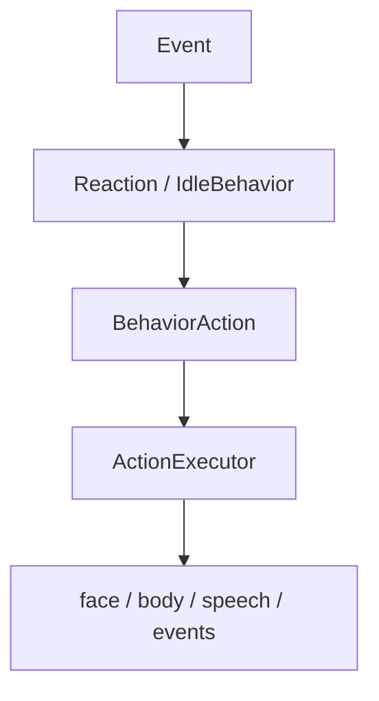

# Behavior engine

Behavior is split into state, reactions, idle behavior, and execution.

## State machine

`RobotState` currently contains:

- `BOOT`
- `IDLE`
- `CURIOUS`
- `LISTENING`
- `THINKING`
- `SPEAKING`
- `SLEEPING`
- `ERROR`

The state machine validates transitions and publishes `StateChanged`.

## Reactions

`ReactionEngine` listens to events and turns them into high-level
`BehaviorAction` values.

Examples include reactions to:

- face detection
- wake-word detection
- speech
- state changes
- idle timeouts
- other robot events

## Idle behavior

`IdleBehavior` runs while the robot is idle and selects actions using the
configured personality.

## Execution

The `ActionExecutor` is the boundary between behavior and concrete outputs.

Keeping execution separate makes behavior easy to test without hardware.

## Behavior library

Reusable higher-level behaviors live under `robot.behavior_library`, including
greeting, thinking, listening, sleeping, excitement, and surprise flows.
