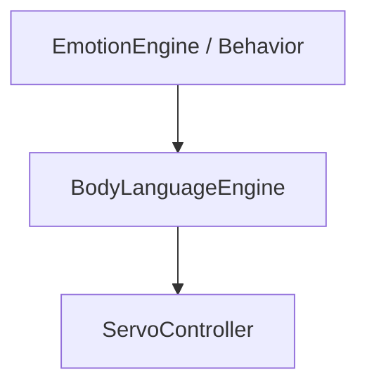

# Body language engine

The body-language engine translates high-level expression requests into
coordinated servo motion. It is intentionally separate from the emotion and
behavior layers.

## Requests

The request types currently include:

- `HeadTilt`
- `HeadNod`
- `LookLeft`
- `LookRight`
- `ArmsRelax`
- `ArmsOpen`
- `Wave`
- `Celebrate`
- `Shrug`
- `Greet`

Requests are expressed as high-level intent. They do not contain raw GPIO
operations.

Each request can produce a sequence of `ServoFrame` values. The engine
interpolates the servo targets over time.

## Pose

`Pose` represents the current target of the robot's servo channels. The
simulation overlay uses the pose to draw a simple body representation.

## Emotion integration

The face emotion model can include a `BodyLanguageHint`:

- `HeadTilt`: neutral, curious, thinking, sleepy, sad, excited
- `ArmPose`: relaxed, open, wide, waving, shrug, down, point
- intensity from 0 to 1
- optional transient gestures

The body engine consumes that hint without the emotion engine ever touching a
servo controller directly.

## Calibration

Servo calibration belongs at the hardware boundary. Channel configuration
contains pulse limits, angle limits, inversion, and backend-specific mapping.

Do not hard-code mechanical limits into behaviors. Configure them and let the
servo layer clamp/translate requests.
