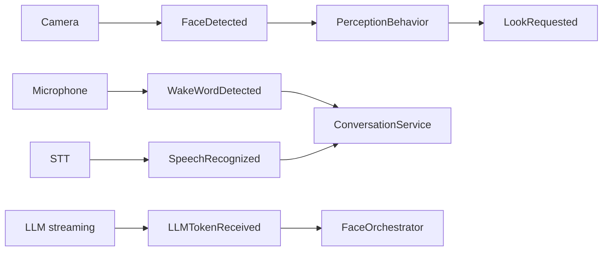

# Event system

DeskBot uses an in-process asynchronous publish/subscribe bus implemented by
`InMemoryEventBus`.

Events are immutable dataclasses. Subscribers register for a concrete event
type; subscribing to `object` receives every event.

A failing subscriber is logged without preventing other subscribers from
running.

## Current event catalogue

| Event | Purpose |
|---|---|
| `RobotStarted` | Application startup |
| `RobotStopped` | Application shutdown |
| `RobotError` | Component failure |
| `StateChanged` | State-machine transition |
| `EmotionChanged` | Current emotion changed |
| `BlinkRequested` | Blink/wink request |
| `LookRequested` | Gaze request |
| `DisplayUpdated` | Frame/display update |
| `AnimationFinished` | Animation completed |
| `ServoMoved` | Servo target changed |
| `IdleTimeout` | Idle period elapsed |
| `PersonalityChanged` | Personality trait changed |
| `FaceDetected` | Camera detected a face (carries normalised `x`/`y` centre, `confidence`, `size`, and `known` — see the [known-face heuristic](perception.md#known-face-heuristic)) |
| `SpeechRecognized` | STT produced text |
| `WakeWordDetected` | Wake word detected |
| `SoundEffectPlayed` | Sound effect played |
| `LLMTokenReceived` | Streaming LLM token arrived |
| `BotReply` | A complete assistant reply was produced |

`PerceptionScan` is also defined by the perception service and is published
when a scan cycle completes.

## Event flow

When adding an event:

1. Add an immutable dataclass to `robot.events.events`.
2. Export it from `robot.events`.
3. Publish it from the owning component.
4. Subscribe where the behavior belongs.
5. Add unit tests.
