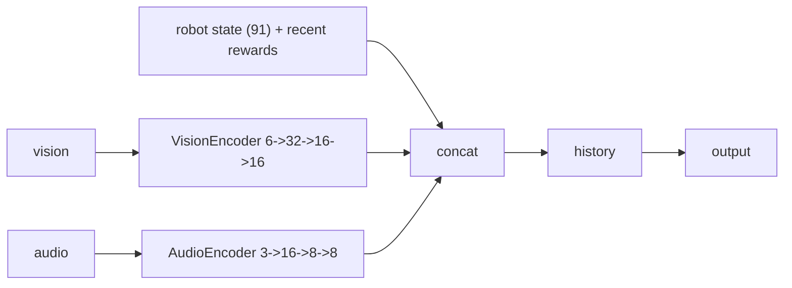
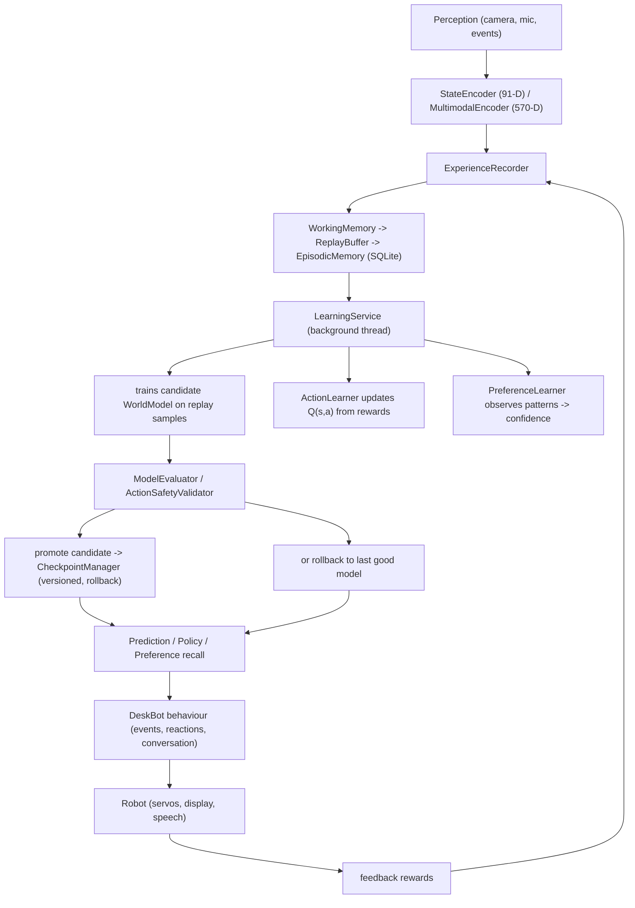

# Local Brain - Learning Module

DeskBot's **local brain** is a self-contained, on-device learning system
implemented in [`robot.learning`](https://github.com/well-it-wasnt-me/deskbot/tree/main/src/robot/learning).
It lets the robot *observe* its environment, *record* experience, *learn*
measurable relationships from that experience, *retain* what it learned, and
*safely* use that knowledge to improve its behaviour - all running locally
on the Raspberry Pi with **no external inference APIs, no pretrained models,
and no cloud calls**.

> See also the high-level [Learning Architecture](../architecture/learning.md)
> overview and the [Production Learning System](../architecture/production-learning.md)
> for the safety, deployment, and online learning hardening layers.
> This document is the detailed reference for the module itself.

---

## Design principles

1. **Local-only** - every neuron, weight, and gradient is computed on the
   device. There is no dependency on OpenAI, Hugging Face, Ollama, or any
   other external AI service for learning.
2. **Non-blocking** - training runs in a daemon thread and is CPU-throttled,
   so it never stalls face rendering, speech, perception, the event loop, or
   hardware control.
3. **Safe by construction** - a candidate model is only promoted after it
   beats the current model on a held-out evaluation set; otherwise it is
   rolled back. Actions produced by the learner are always validated before
   execution.
4. **Observable** - status, configuration, and learned preferences are
   exposed through the REST API and (see below) a dedicated web dashboard.
5. **Graceful degradation** - learning is an *enhancement*, never a single
   point of failure. If training crashes, a checkpoint is corrupt, or a
   sensor is missing, the robot keeps operating with the last valid model.
6. **Deterministic encoding** - the state encoder always produces the same
   vector for the same inputs, which is critical for training stability.

---

## Module map

```
robot/learning/
├── tensor.py            # Thin NumPy-backed Tensor wrapper (the foundation)
├── activations.py       # relu, sigmoid, tanh, linear, softmax + derivatives
├── losses.py            # mse & cross-entropy losses + derivatives
├── layers.py            # DenseLayer (forward/backward, He/Xavier init)
├── optimizers.py        # SGD (+momentum) and Adam
├── network.py           # Network (fwd/bwd/train) + MLP convenience factory
├── demo.py              # Standalone XOR / regression proofs of the NN core
├── state_encoder.py     # Deterministic 91-D state vector from robot context
├── experience.py        # Experience tuple + WorkingMemory/ReplayBuffer/Episodic
├── recorder.py          # Event-bus -> experience bridge (StateEncoder + memory)
├── world_model.py       # Predict next_state from (state, action); SimpleEnvironment
├── action_learning.py   # Q-learning w/ function approx; ActionSpace; ActionLearningEnv
├── multimodal.py        # Trainable vision/audio sub-encoders + history window
├── preference_learner.py# Confidence-scored preference learning with decay
├── safety.py            # ModelEvaluator, ActionSafetyValidator, LearningSafetyManager
├── observation_adapter.py # Event-bus -> PreferenceLearner bridge (user-preference signals)
├── learning_service.py  # Background continual-learning service (the orchestrator)
│
│   ── Production hardening (Phases 1-9) ──
├── transition.py            # Phase 1: TransitionStore lifecycle + validation
├── observation.py           # Phase 2: Typed Observation / RobotObservation / VisionObservation
├── reward.py                # Phase 2: RewardModel with pluggable components
├── deterministic_encoder.py # Phase 3: Stateless DeterministicMultimodalEncoder
├── dataset.py               # Phase 4: TransitionDataset + WorldModelBaseline
├── evaluation.py            # Phase 5: EvaluationDataset (frozen, versioned) + PromotionRule
├── shadow_policy.py         # Phase 6: ShadowPolicyController (off/shadow/assist/active)
├── safety_gate.py           # Phase 7: SafetyGate (3-layer) + SafeActionExecutor
├── model_registry.py        # Phase 8: ModelRegistry (atomic deploy, rollback) + CanaryDeploymentManager
└── online_learning.py       # Phase 9: OnlineLearningMonitor + ConstrainedExploration + ReplayWarmer
```

The module is layered in ten Parts, each building on the previous one:

| Part | Components                                                           | Purpose                                                               |
|------|----------------------------------------------------------------------|-----------------------------------------------------------------------|
| 1    | `tensor`, `activations`, `losses`, `layers`, `optimizers`, `network` | Minimal neural-network framework built from scratch                   |
| 2    | `experience`, `recorder`                                             | Experience memory + event-bus recording                               |
| 3    | `state_encoder`                                                      | Deterministic multimodal state vector                                 |
| 4    | `world_model`                                                        | Predict `next_state` from `(state, action)`                           |
| 5    | `action_learning`                                                    | Q-learning policy over a registered action space                      |
| 6    | `learning_service`                                                   | Background continual learning (train / evaluate / promote / rollback) |
| 7    | `multimodal`                                                         | Trainable vision & audio sub-encoders + temporal history              |
| 8    | `preference_learner`                                                 | Confidence-scored, decaying preference learning                       |
| 9    | `safety`                                                             | Candidate evaluation, action validation, rollback, failure handling   |
| 10   | config / CLI / REST API / web                                        | Production integration surface                                        |

---

## Part 1 - Neural-network core

A tiny but complete framework, so the rest of the learning code never
touches NumPy directly.

### `Tensor` (`tensor.py`)

A thin wrapper around a `float64` NumPy array with element-wise arithmetic
(`+`, `-`, `*`, `/`, `@`), reductions (`sum`, `mean`), reshaping, and
creation helpers (`zeros`, `ones`, `randn`, `uniform`, `from_row`). Swapping
the backend later only requires changing this one class.

### Activations (`activations.py`)

Each activation is a `(forward, derivative)` pair registered in
`ACTIVATIONS`:

| Name      | Forward                     | Derivative convention                    |
|-----------|-----------------------------|------------------------------------------|
| `relu`    | `max(0, x)`                 | `1` where `x > 0` else `0`               |
| `sigmoid` | numerically-stable logistic | `s·(1-s)` (pass the **output**)          |
| `tanh`    | `np.tanh`                   | `1 - t²` (pass the **output**)           |
| `linear`  | identity                    | `1`                                      |
| `softmax` | stable softmax              | returns output itself (combined with CE) |

### Losses (`losses.py`)

- **MSE** - `mean((pred - target)²)`, derivative `2·(pred - target)/n`.
- **Cross-entropy** - `-mean(Σ target·log(pred))`, combined softmax+CE
  derivative `pred - target`.

### `DenseLayer` (`layers.py`)

A fully-connected layer storing `weights`, `biases`, and their gradients.
`forward` computes `activation(x @ W + b)`; `backward` computes
batch-averaged weight/bias gradients and propagates the input gradient.
Supports `he`, `xavier`, and `normal` weight initialisation.

### Optimizers (`optimizers.py`)

- **SGD** with optional momentum.
- **Adam** (Kingma & Ba) with bias-corrected first/second moment estimates.

### `Network` / `MLP` (`network.py`)

`Network` owns the layers and provides `forward`, `backward`, `train_step`
(forward -> loss -> backward -> optimise), `predict`, JSON `save`/`load`, and
`param_count`. `MLP` is a convenience factory that builds a
`input -> Dense·act -> … -> Dense·out_act` stack with reproducible per-layer
seeds.

### Proof it works (`demo.py`)

`demo_xor()` trains a `[8,8]` tanh MLP on XOR; `demo_regression()` fits
`y = 2x + 1 + noise`. Both verify that loss decreases and trained
predictions beat untrained ones. This module is **not** connected to the
robot - it is a standalone correctness proof.

---

## Part 2 - Experience memory & recording

### `Experience` (`experience.py`)

A frozen dataclass capturing one observation–action–outcome tuple:

```
timestamp · state[] · action[] · reward · next_state[] · metadata{}
```

with `to_dict` / `from_dict` serialisation and `*_tensor()` helpers.

### Three memory layers

| Layer      | Class            | Role                               | Persistence                            |
|------------|------------------|------------------------------------|----------------------------------------|
| Short-term | `WorkingMemory`  | Ring buffer of recent experiences  | None (in-memory)                       |
| Training   | `ReplayBuffer`   | Uniform-random mini-batch sampling | None (in-memory)                       |
| Long-term  | `EpisodicMemory` | Survives restarts                  | `ExperienceStore` (SQLite / in-memory) |

`SqliteExperienceStore` matches the pattern of the conversation and
preference SQLite stores (WAL journal, auto-created schema, JSON-encoded
vectors). `InMemoryExperienceStore` is provided for tests.

### `ExperienceRecorder` (`recorder.py`)

The bridge from the live event bus to memory. It subscribes to
`StateChanged`, `EmotionChanged`, `ServoMoved`, `FaceDetected`,
`SpeechRecognized`, and `IdleTimeout`, updates the `StateEncoder`, and
records experiences. Each event type maps to a stable action-vector layout
(`_action_vector_from_event`): a one-hot event-type prefix followed by
event-specific parameters (emotion one-hot + intensity, normalised servo
angle, face x/y/confidence, speech presence, idle minutes). Small shaping
rewards are assigned per event (e.g. `+0.1` for seeing a face, `-0.1` for
idling).

---

## Part 3 - State encoder (`state_encoder.py`)

Converts DeskBot's current context into a **deterministic, fixed-size
91-element** vector. Layout (`ENCODER_VERSION = 1`):

| Range | Section     | Contents                                                           |
|-------|-------------|--------------------------------------------------------------------|
| 0–9   | emotions    | one intensity per `EmotionName` (10)                               |
| 10–17 | robot_state | one-hot per `RobotState` (8)                                       |
| 18–22 | personality | curiosity, energy, shyness, friendliness, playfulness              |
| 23–32 | servos      | pan, tilt, left_arm, right_arm + 6 reserved (normalised to [-1,1]) |
| 33–38 | vision      | face_detected, x, y, confidence, size, count                       |
| 39–41 | audio       | RMS energy, peak amplitude, zero-crossing rate                     |
| 42–45 | flags       | speaking, listening, interaction, idle-time                        |
| 46–50 | rewards     | 5 most recent reward values                                        |
| 51–90 | reserved    | zeros for future features                                          |

`VisionFeatures` is built from face-detection results; `AudioFeatures.from_pcm()`
extracts RMS / peak / ZCR from raw 16-bit PCM. Missing sensors fall back to
safe defaults (no face -> `0.5` positions; no audio -> `0.0`). The encoder
sanitises `NaN`/`inf` to `0.0`. `state_layout()` returns the slice map for
introspection.

---

## Part 4 - World model (`world_model.py`)

DeskBot's first genuine learning behaviour: an MLP that predicts

```
[state, action] -> predicted next_state
```

trained on experience replay with MSE loss and Adam. Key APIs:

- `predict` / `predict_batch` - single and batched next-state prediction.
- `train(experiences, val_experiences, epochs, batch_size)` - returns a
  `TrainingResult` with per-epoch `TrainingMetrics` (train/val loss,
  elapsed) and an `improved` flag.
- `evaluate(experiences)` - mean MSE on a dataset.
- `save` / `load` (JSON checkpoints) and `param_count()`.

`SimpleEnvironment` is a 2-D "face position" simulation (look-left /
look-right shifts `x` by a step with Gaussian noise) used to generate
predictable transitions that the world model should learn to forecast.

---

## Part 5 - Action learning (`action_learning.py`)

A Q-learning policy with function approximation.

- **`ActionSpace`** - registry of `LearningAction`s (index, name,
  description, action_type, params). `deskbot_action_space()` registers the
  10 standard DeskBot actions: `look_left/right/center/up/down`, `blink`,
  `wink`, `celebrate`, `sleep`, `look_around`.
- **`ActionLearner`** - an MLP mapping `[state, action_onehot] -> Q(s,a)`.
  Action selection is **epsilon-greedy** with exponential decay
  (`epsilon_start -> epsilon_end`, `epsilon_decay` per step) and a
  configurable `ActionValidator` gating. `train_step` / `train_batch`
  apply the Bellman update `target = r + γ·maxₐ Q(s', a')` (or just `r`
  when `done`).
- **`ActionLearningEnv`** - a simulation with a shaped reward structure
  (e.g. `celebrate` with a face -> `+1.0`; `sleep` -> `-0.5`; `look_center`
  with a face -> `+0.5`).

The learner **never** touches hardware directly - it only produces action
indices that must be validated and executed by the existing action
executor.

---

## Part 6 - Continual learning service (`learning_service.py`)

The orchestrator that ties everything together in a **background daemon
thread**.

### Lifecycle

1. `start()` attaches the `ExperienceRecorder` to the bus and launches the
   training thread.
2. The thread loop periodically calls `_maybe_train()`.
3. `_run_training_cycle()`:
   - samples experiences from the replay buffer (80/20 train/eval split),
   - trains the **candidate** world model,
   - evaluates candidate vs **current** model,
   - **promotes** the candidate (saving a checkpoint of the old current) or
     **rolls back** the candidate to the current weights,
   - updates `TrainingStatus` and CPU-throttles itself.
4. `stop()` joins the thread and detaches the recorder.

### Configuration dataclasses

- **`LearningSchedule`** - `min_new_experiences`, `train_interval_s`,
  `min_experiences_for_training`.
- **`ResourceLimits`** - `max_cpu_fraction` (soft limit via interleaved
  `sleep`), `batch_size`, `max_memory_mb`, `max_model_params`,
  `training_epochs_per_cycle`, `eval_sample_size`.
- **`CheckpointConfig`** - `checkpoint_dir`, `keep_last_n`,
  `promote_threshold` (candidate promoted iff
  `candidate_loss ≤ current_loss × threshold`).
- **`CheckpointManager`** - versioned, time-stamped checkpoint files with
  automatic cleanup of old ones.
- **`TrainingStatus`** - a thread-safe, read-only snapshot
  (`total_experiences`, `new_experiences_since_train`,
  `training_cycles_completed`, current/candidate loss,
  `last_training_time/duration`, `is_training`, `promotions`, `rollbacks`,
  `model_version`).

`force_training()` triggers an immediate cycle; `record_experience()` adds
one manually; `load_latest_checkpoint()` restores the last good model.

---

## Part 7 - Multimodal learning (`multimodal.py`)

Extends the deterministic state encoder with **trainable** sub-encoders and
a **temporal history** window so the representation can capture cross-modal
relationships (e.g. "loud sound + no face -> user is away").



- **`VisionEncoder` / `AudioEncoder`** - small MLPs over the hand-crafted
  feature vectors, trainable with `train_step`.
- **`HistoryBuffer`** - ring buffer of the last `history_length` state
  snapshots, flattened (zero-padded when not yet full).
- **`MultimodalEncoder`** - concatenates `robot_state(91) +
  vision_encoded(16) + audio_encoded(8) + history(91×5)` = **570** elements
  by default (`multimodal_size()`). Provides ablation helpers
  (`encode_unimodal_vision`, `encode_unimodal_audio`, `encode_no_history`).
- **`MultimodalEnvironment`** - a simulation where vision, audio, and their
  combination each yield different optimal actions, plus ready-made
  scenarios (`scenario_vision_matters`, `scenario_audio_matters`,
  `scenario_both_matters`) for ablation studies.

---

## Part 8 - Preference learning (`preference_learner.py`)

Learns operationally-relevant preferences (interaction style, preferred
actions, emotional responses, timing, face/volume preferences) -
**never** sensitive personal attributes.

- **`PatternObservation`** - one observation of a `(category, value)` pair
  with a reward and a source (`"behavioral"` inferred or `"explicit"`
  user-stated).
- **`LearnedPreference`** - accumulates observations into a confidence
  score, observation count, first/last observed timestamps, total reward,
  and source.
- **`PreferenceLearner`**:
  - `observe()` boosts confidence (`_EXPLICIT_BOOST=0.3`,
    `_INFERRED_BOOST=0.15`); a pattern becomes a persisted preference after
    `_MIN_OBSERVATIONS=3` or once confidence ≥ `_CONFIDENCE_THRESHOLD=0.5`.
  - `observe_from_reward()` treats high-reward actions as preferred and
    low-reward as dispreferred.
  - `apply_decay()` reduces confidence by `_DAILY_DECAY_RATE=0.02`/day
    without reinforcement (floored at `min_confidence`), so the robot can
    adapt to changed user behaviour.
  - Persistence rides on the existing `PreferenceStore` (in-memory or
    SQLite); `load_from_store()` rehydrates on startup.

---

## Part 9 - Safety, evaluation & rollback (`safety.py`)

Guarantees that learning can never degrade robot behaviour.

- **`ModelEvaluator`** compares a candidate against the current model on a
  fixed evaluation set, measuring loss, prediction latency, and prediction
  standard deviation.
- **`EvaluationThresholds`** - a candidate is promoted only if **all** pass:
  `min_improvement_ratio`, `max_loss`, `max_prediction_latency_s`,
  `max_prediction_std`.
- **`EvaluationResult`** - `candidate_loss`, `current_loss`,
  `improvement_ratio`, `passed`, plus `metric_details`.
- **`ActionSafetyValidator`** - blocks unknown action names, out-of-range
  servo angles / look speeds / blink rates / sleep durations, and enforces a
  per-second action rate limit.
- **`LearningSafetyManager`** - coordinates evaluation, action validation,
  and checkpoint-based rollback.

---

## Part 10 - Integration surface

### Configuration (`LearningConfig`)

All parameters are environment-configurable via `DESKBOT_LEARNING__*`
(loaded by `robot.config.AppSettings.learning`):

| Variable                                         | Default                     | Description                             |
|--------------------------------------------------|-----------------------------|-----------------------------------------|
| `DESKBOT_LEARNING__ENABLED`                      | `false`                     | Enable experience recording & learning  |
| `DESKBOT_LEARNING__STORE`                        | `memory`                    | `memory` or `sqlite` experience backend |
| `DESKBOT_LEARNING__DB_PATH`                      | `~/.deskbot/experiences.db` | SQLite path                             |
| `DESKBOT_LEARNING__WORKING_MEMORY_CAPACITY`      | `256`                       | Short-term ring buffer                  |
| `DESKBOT_LEARNING__REPLAY_BUFFER_CAPACITY`       | `10000`                     | Replay buffer size                      |
| `DESKBOT_LEARNING__EPISODIC_CAPACITY`            | `10000`                     | Episodic memory size                    |
| `DESKBOT_LEARNING__MIN_NEW_EXPERIENCES`          | `32`                        | New exps before a cycle                 |
| `DESKBOT_LEARNING__TRAIN_INTERVAL_S`             | `30.0`                      | Min seconds between cycles              |
| `DESKBOT_LEARNING__MIN_EXPERIENCES_FOR_TRAINING` | `64`                        | Min total exps to start                 |
| `DESKBOT_LEARNING__BATCH_SIZE`                   | `32`                        | Mini-batch size                         |
| `DESKBOT_LEARNING__TRAINING_EPOCHS_PER_CYCLE`    | `5`                         | Epochs per cycle                        |
| `DESKBOT_LEARNING__EVAL_SAMPLE_SIZE`             | `128`                       | Exps sampled for evaluation             |
| `DESKBOT_LEARNING__MAX_CPU_FRACTION`             | `0.3`                       | Soft CPU cap for training               |
| `DESKBOT_LEARNING__MAX_MODEL_PARAMS`             | `500000`                    | Max trainable params/model              |
| `DESKBOT_LEARNING__CHECKPOINT_DIR`               | `~/.deskbot/checkpoints`    | Checkpoint dir                          |
| `DESKBOT_LEARNING__KEEP_LAST_N_CHECKPOINTS`      | `5`                         | Checkpoints kept on disk                |
| `DESKBOT_LEARNING__PROMOTE_THRESHOLD`            | `1.0`                       | Promotion improvement factor            |

### CLI (`robot.cli.learning`)

`deskbot-learning` exposes `status`, `train`, `evaluate --model <path>`,
`reset [--confirm]`, and `export [--output <path>]`. The CLI reads the
checkpoint directory from settings; `train` notes that live forcing should
go through the REST API.

### REST API (`robot.api.learning`)

Router prefix `/api/v1/learning`:

| Method | Path           | Returns                                                                                                     |
|--------|----------------|-------------------------------------------------------------------------------------------------------------|
| `GET`  | `/status`      | `TrainingStatus` snapshot (experiences, losses, cycles, promotions/rollbacks, model version, `is_training`) |
| `GET`  | `/preferences` | Learned preferences + total tracked patterns                                                                |
| `GET`  | `/config`      | Schedule, resource limits, checkpoint config                                                                |
| `POST` | `/train`       | Force an immediate training cycle                                                                           |

### Web dashboard

A dedicated page is served at **`/learning`** (see
[`web/learning/index.html`](https://github.com/well-it-wasnt-me/deskbot/tree/main/web/learning))
that polls the REST API and visualises, in real time:

- whether the brain is enabled / available,
- total & new-since-train experience counts,
- training-cycle count, promotions vs rollbacks, model version,
- current and candidate model loss,
- last training time and duration, live "training now" indicator,
- the active schedule, resource limits, and checkpoint configuration,
- all learned preferences with confidence, observation count, and reward,
- a **Force training** button.

The page degrades gracefully: if learning is disabled (the default) or the
service is otherwise unavailable, it shows a clear "not available" banner
rather than failing.

---

## Integration into DeskBotApp

The learning module is wired into the live application via
`DeskBotApp` (see `_build_learning_service` and the lifecycle hooks in
`src/robot/app.py`). It is **opt-in** and disabled by default
(`DESKBOT_LEARNING__ENABLED=false`); enable it with:

```bash
DESKBOT_LEARNING__ENABLED=true
```

### What happens when enabled

1. **Build** - `DeskBotApp.build()` calls `_build_learning_service(settings, bus)`,
   which constructs (from `settings.learning`):
   - a `LearningSchedule`, `ResourceLimits`, and `CheckpointConfig`,
   - a `LearningService` with a `WorldModel`, `ActionLearner`,
     `ExperienceRecorder`, `WorkingMemory` and `ReplayBuffer` sized from
     config (`working_memory_capacity`, `replay_buffer_capacity`,
     `replay_seed`),
   - a `PreferenceLearner` (with a matching persistence backend - see
     below), whose persisted preferences are rehydrated on startup,
   - a `LearningSafetyManager` wrapping the service's `CheckpointManager`.
2. **Startup** - `_on_startup` loads the latest checkpoint
   (`load_latest_checkpoint()`) and starts the background training thread
   (`learning_service.start()`). The recorder attaches to the event bus and
   begins turning robot events into experiences.
3. **Shutdown** - `_on_shutdown` calls `learning_service.stop()` (joining the
   daemon thread) and clears the references.
4. **API** - `_start_api` exposes the service on the FastAPI app state:
   `app.state.learning_service` and `app.state.safety_manager`, so the
   `/api/v1/learning/*` endpoints and the `/learning` web dashboard serve
   live data.

Every step is wrapped in defensive `try`/`except` (via `contextlib.suppress`):
if checkpoint loading or the service start fails, the robot continues
operating normally - learning is an enhancement, never a single point of
failure.

### Persistence backends

`LearningService` now carries a `preference_learner: PreferenceLearner | None`
field, and the `/preferences` endpoint is guarded against a missing learner
(returning an empty list). Persistence is tied to `DESKBOT_LEARNING__STORE`:

| `store`  | Episodic memory                      | Preference learner store                                             |
|----------|--------------------------------------|----------------------------------------------------------------------|
| `memory` | `None` (in-memory only)              | `InMemoryPreferenceStore`                                            |
| `sqlite` | `SqliteExperienceStore` at `db_path` | `SqlitePreferenceStore` at `<db_path parent>/learned_preferences.db` |

So with `DESKBOT_LEARNING__STORE=sqlite`, both experiences and learned
preferences survive restarts.

### Interaction with sound effects

The learning `ExperienceRecorder` subscribes to the same event bus as the
new :class:`SoundReactor` (`robot.behavior.sound_reactor`), which plays the
`assets/sounds/` WAVs in reaction to emotion/state changes (e.g.
`thinking` while pondering, `angry`/`surprise`/`cute`/`very-cute`/`confused`
on emotion changes). Those sound-play events flow back into the experience
stream, closing the observe->learn loop. See
[Speech & Sound Effects](speech.md) for the sound side.

---

## Data flow (end to end)


