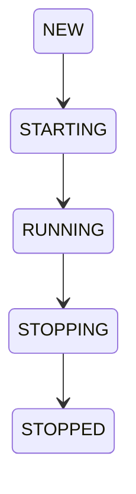

# Lifecycle & degradation

DeskBot's lifecycle package (`robot.lifecycle`) provides the async-safe
startup/shutdown controller and the graceful degradation registry that keeps
the robot running even when hardware fails.

> See also the [Lifecycle architecture](../architecture/lifecycle.md) for the
> design rationale and data flow.

---

## Lifecycle

`Lifecycle` is the only place that owns the root task group and the event-bus
subscription. Components subscribe to events in `startup` and unsubscribe in
`shutdown`; the manager guarantees both are called exactly once and all errors
are surfaced.

### States



### Hooks

| Hook | When | Purpose |
|------|------|---------|
| `on_startup` | Application starts | Subscribe to events, start background tasks |
| `on_shutdown` | Application stops | Unsubscribe, cancel tasks, close resources |

Hooks are `async` callables. The manager runs all startup hooks, then all
shutdown hooks in reverse order. If any hook raises, the error is logged and
the remaining hooks still run.

### Usage

```python
from robot.lifecycle import Lifecycle

lifecycle = Lifecycle(bus=event_bus)
lifecycle.add_startup(my_component.start)
lifecycle.add_shutdown(my_component.stop)

async with lifecycle.running() as task_group:
    await anyio.sleep_forever()
```

---

## Graceful degradation

When a hardware component (display, servos, microphone, etc.) fails to
initialise, the application falls back to a mock implementation and records
the failure in the `DegradationRegistry`.

### Design principles

- The robot **never crashes** due to a hardware failure.
- Every component has a mock fallback.
- Degradation entries are logged at `WARNING` level, not `ERROR`.
- The registry is accessible via the API even in `ERROR` state.

### DegradationEntry

Each entry records:

| Field | Description |
|-------|-------------|
| `component` | Which component degraded (e.g. `"display"`, `"servos"`) |
| `status` | `"ok"`, `"degraded"`, or `"failed"` |
| `original_backend` | The configured backend that failed |
| `fallback_backend` | The mock/no-op backend used instead |
| `error` | The error message (if any) |

### safe_init

`safe_init()` is the helper that wraps factory construction with automatic
fallback:

```python
from robot.lifecycle import safe_init

display = safe_init(
    factory=lambda: GC9A01Display(...),
    component="display",
    fallback=MockDisplay,
    registry=degradation_registry,
    original_backend="gc9a01",
    fallback_backend="mock",
)
```

If the factory raises, `safe_init` logs the error, records a degradation entry,
and returns the fallback instance instead. The robot continues operating with
the mock — it just won't have a real display.

### Health endpoint

The `GET /api/v1/health` endpoint exposes the degradation registry so
external monitoring tools can see which components are running in degraded
mode:

```json
{
  "status": "degraded",
  "components": [
    {"component": "display", "status": "degraded", "original": "gc9a01", "fallback": "mock"}
  ]
}
```

---

## API reference

::: robot.lifecycle
    options:
      show_root_heading: true
