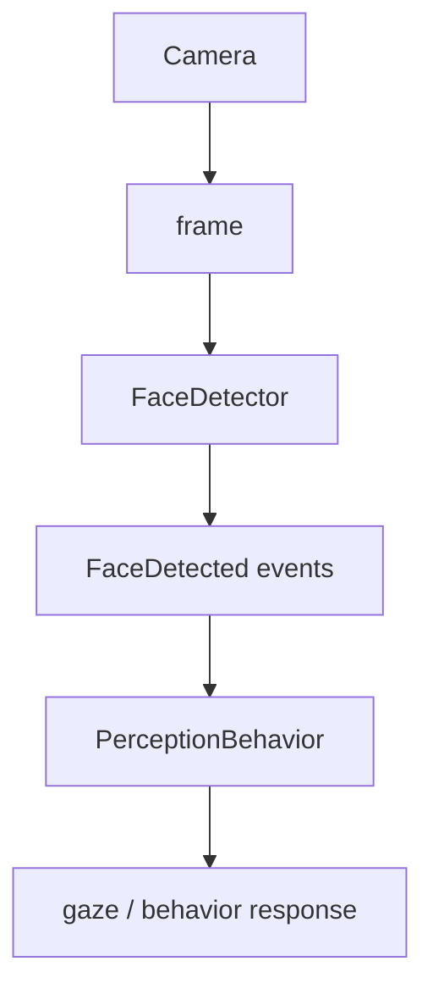

# Perception

The perception service connects a camera to the event bus.

## Pipeline



## Face detectors

The project can select the best available detector:

- YuNet when the supported OpenCV neural-network path is available.
- OpenCV cascade detection as a fallback.
- `NullFaceDetector` for headless environments.

The detector is abstracted behind the `FaceDetector` protocol.

## Adaptive scanning

`PerceptionService` changes its scan interval with robot state.

Defaults:

| State | Interval |
|---|---:|
| IDLE / default | 2.0 s |
| CURIOUS / LISTENING / THINKING | 0.3 s |
| SLEEPING | 4.0 s |

The generic configured fallback is 0.5 s.

Configure with:

```env
DESKBOT_PERCEPTION__ENABLED=true
DESKBOT_PERCEPTION__SCAN_INTERVAL_S=0.5
DESKBOT_PERCEPTION__IDLE_SCAN_INTERVAL_S=2.0
DESKBOT_PERCEPTION__CURIOUS_SCAN_INTERVAL_S=0.3
DESKBOT_PERCEPTION__MAX_FACES=3
DESKBOT_PERCEPTION__SCORE_THRESHOLD=0.5
```

## Camera

The current real camera implementation is `UsbCamera`. The default camera
configuration is 640×480 at 30 FPS.

```env
DESKBOT_CAMERA__DEVICE=0
DESKBOT_CAMERA__WIDTH=640
DESKBOT_CAMERA__HEIGHT=480
DESKBOT_CAMERA__FPS=30
```

Use the mock camera for tests and headless development.
