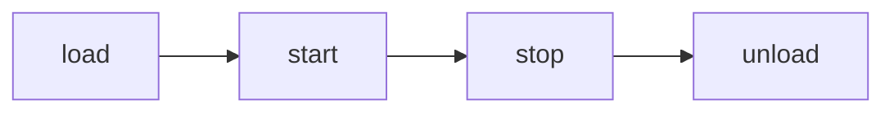
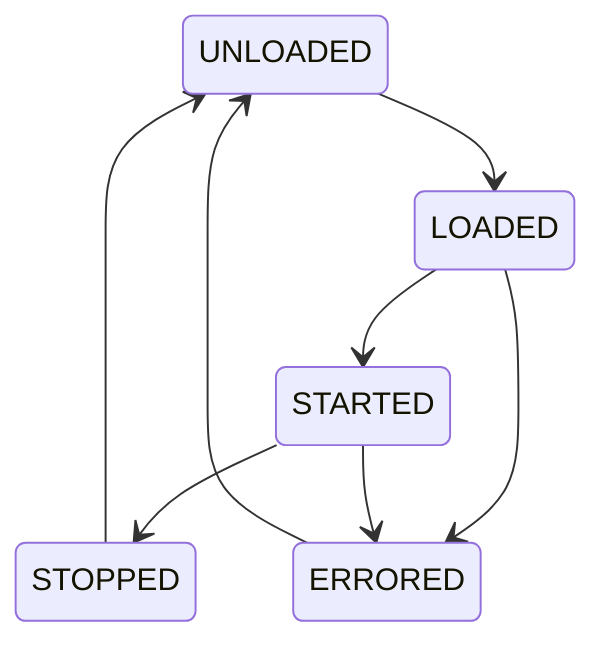

# Plugin System

DeskBot has a plugin registry based on Python entry points. Plugins can
subscribe to events, register new commands, and extend the application
lifecycle without modifying the core codebase.

---

## The Plugin protocol

Every plugin must implement the [`Plugin`][robot.plugins.plugin.Plugin]
protocol. The lifecycle is:



| Hook | Called when | Purpose |
|------|------------|---------|
| [`load()`][robot.plugins.plugin.Plugin.load] | Plugin is first loaded | Register event handlers, set up resources |
| [`start()`][robot.plugins.plugin.Plugin.start] | Application starts running | Begin background tasks |
| [`stop()`][robot.plugins.plugin.Plugin.stop] | Application is shutting down | Cancel background tasks |
| [`unload()`][robot.plugins.plugin.Plugin.unload] | Plugin is being removed | Clean up persistent resources |

Only `info` and `load` are required; the other hooks have safe no-op
defaults.

### PluginState

Each plugin has a [`PluginState`][robot.plugins.plugin.PluginState] that
tracks its lifecycle:



### PluginInfo

[`PluginInfo`][robot.plugins.plugin.PluginInfo] is a frozen dataclass
with metadata about the plugin:

| Field | Type | Description |
|-------|------|-------------|
| `name` | `str` | Unique plugin identifier |
| `version` | `str` | Semantic version (default `"0.1.0"`) |
| `description` | `str` | Human-readable description |
| `author` | `str` | Author name |
| `depends` | `tuple[str, ...]` | Names of plugins this one depends on |

---

## PluginRegistry

[`PluginRegistry`][robot.plugins.registry.PluginRegistry] manages the
full lifecycle of every plugin and ensures dependency ordering:

```python
from robot.plugins.registry import PluginRegistry
from robot.events.bus import InMemoryEventBus

bus = InMemoryEventBus()
registry = PluginRegistry(bus=bus)

# Register plugins
registry.register(my_plugin)

# Load and start all plugins (respects dependency order)
await registry.load_all()
await registry.start_all()

# Later, shut down
await registry.stop_all()
await registry.unload_all()
```

### Registry API

| Method | Description |
|--------|-------------|
| `register(plugin)` | Register a plugin by name |
| `unregister(name)` | Remove a plugin (must be UNLOADED or ERRORED) |
| `load_all()` | Load all registered plugins in dependency order |
| `start_all()` | Start all loaded plugins |
| `stop_all()` | Stop all started plugins in reverse order |
| `unload_all()` | Unload all plugins in reverse order |
| `get(name)` | Return a plugin by name |
| `list_plugins()` | Return info for all registered plugins |
| `state_of(name)` | Return the current state of a plugin |
| `discover_entry_points()` | Discover plugins from `deskbot.plugins` entry points |

Plugins are loaded in topological order so that dependencies are satisfied.
Circular dependencies raise a `PluginError`.

---

## Entry-point discovery

A package can register a plugin via Python entry points:

```toml
[project.entry-points."deskbot.plugins"]
my_plugin = "my_package.plugins:MyPlugin"
```

Enable entry-point discovery with environment variables:

```bash
DESKBOT_PLUGINS__ENABLED=true
DESKBOT_PLUGINS__DISCOVER_ENTRY_POINTS=true
```

Explicit plugin packages can also be configured:

```bash
DESKBOT_PLUGINS__PLUGIN_PACKAGES='["my_package"]'
```

---

## Example: a minimal plugin

```python
"""A minimal plugin that subscribes to events."""

from robot.plugins.plugin import Plugin, PluginInfo, PluginState
from robot.events.bus import InMemoryEventBus
from robot.events.events import EmotionChanged


class GreetPlugin:
    """Logs a greeting whenever the robot changes emotion."""

    def __init__(self, bus: InMemoryEventBus) -> None:
        self._bus = bus
        self._sub_id: int | None = None

    @property
    def info(self) -> PluginInfo:
        return PluginInfo(
            name="greet",
            version="1.0.0",
            description="Logs a message on emotion changes",
        )

    async def load(self) -> None:
        # Subscribe to the event bus
        self._sub_id = self._bus.subscribe(EmotionChanged, self._on_emotion)

    async def start(self) -> None:
        pass  # No background tasks needed

    async def stop(self) -> None:
        pass  # No background tasks to cancel

    async def unload(self) -> None:
        # Remove the event handler
        if self._sub_id is not None:
            self._bus.unsubscribe(self._sub_id)

    async def _on_emotion(self, event: EmotionChanged) -> None:
        print(f"Emotion changed: {event.previous} -> {event.current}")
```

### Built-in plugins

DeskBot ships with three built-in plugins:

| Plugin | Description |
|--------|-------------|
| `MqttBridgePlugin` | Publishes/subscribes events via MQTT |
| `HomeAssistantPlugin` | Exposes the robot as an HA entity via MQTT Auto Discovery |
| `CalibrationPlugin` | Serves a web-based calibration dashboard |

Plugins should use the event bus rather than reaching directly into
unrelated application components.

---

## API reference

::: robot.plugins.plugin.Plugin
    options:
      show_root_heading: true

::: robot.plugins.plugin.PluginInfo
    options:
      show_root_heading: true

::: robot.plugins.plugin.PluginState
    options:
      show_root_heading: true

::: robot.plugins.registry.PluginRegistry
    options:
      show_root_heading: true

::: robot.plugins.registry.PluginError
    options:
      show_root_heading: true
