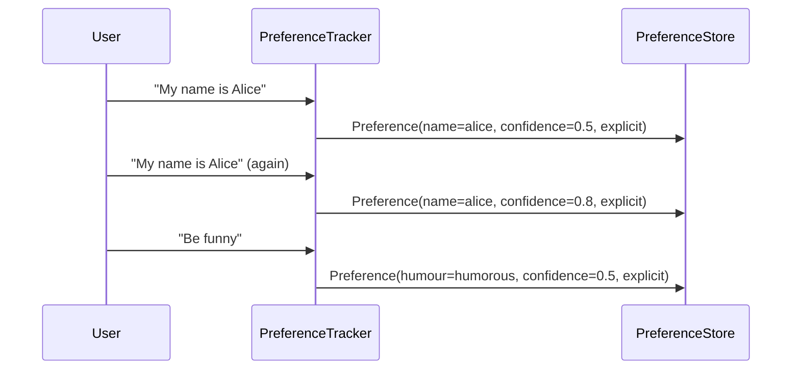

# Preference Tracking

DeskBot's **preference tracker** learns user preferences from conversation
text — name, volume, pace, formality, humour, verbosity, language — and
stores them with confidence scores so the robot can personalise its
behaviour over time.

---

## How it works

The [`PreferenceTracker`][robot.ai.preferences.PreferenceTracker] analyses
each user utterance for explicit preference statements (e.g. *"my name is
Alice"*, *"be funny"*, *"slow down"*). When a pattern matches, it creates
or updates a [`Preference`][robot.ai.preferences.Preference] in the store
with a confidence score that increases on repeated observations.



### Confidence boosting

| Source | Confidence boost per observation |
|--------|--------------------------------|
| `explicit` | +0.3 |
| `inferred` | +0.1 |

Confidence is capped at 1.0. First explicit observation starts at 0.5,
first inferred observation at 0.2.

---

## Supported categories

| Key | Patterns (examples) | Possible values |
|-----|---------------------|-----------------|
| `name` | "my name is …", "I'm called …", "call me …" | Any string |
| `nickname` | "my nickname is …" | Any string |
| `volume` | "louder", "quieter", "too loud", "turn it down" | `high`, `low` |
| `pace` | "slower", "faster", "slow down", "speed up" | `slow`, `fast` |
| `formality` | "be formal", "be casual", "talk casually" | `formal`, `casual` |
| `humour` | "be funny", "be serious", "more jokes" | `humorous`, `serious` |
| `verbosity` | "be brief", "more detail", "be verbose" | `brief`, `detailed` |
| `language` | "speak English", "en español", "speak French" | `en`, `es`, `fr`, `de` |

---

## Usage

```python
from robot.ai.preferences import PreferenceTracker, InMemoryPreferenceStore

# Create a tracker with an in-memory store
tracker = PreferenceTracker()

# Process user utterances
updated = tracker.process_user_text("My name is Alice")
# -> [Preference(key='name', value='alice', confidence=0.5, source='explicit')]

updated = tracker.process_user_text("Be funny")
# -> [Preference(key='humour', value='humorous', confidence=0.5, source='explicit')]

# Retrieve a specific preference
pref = tracker.get("name")
# Preference(key='name', value='alice', confidence=0.5, source='explicit')

# Format preferences for an LLM system prompt
prompt_text = tracker.format_for_prompt()
# "User preferences:\n- name: alice (confidence: 50%, source: explicit)\n- humour: humorous ..."
```

### With SQLite persistence

```python
from robot.ai.preferences import PreferenceTracker, SqlitePreferenceStore

store = SqlitePreferenceStore(db_path="preferences.db")
tracker = PreferenceTracker(store=store)

# Preferences are persisted to disk automatically
tracker.process_user_text("My name is Bob")

# Later, in a different session:
tracker2 = PreferenceTracker(store=SqlitePreferenceStore(db_path="preferences.db"))
name = tracker2.get("name")
# Preference(key='name', value='bob', ...)
```

---

## Store backends

### InMemoryPreferenceStore

Simple dict-backed store for testing. Preferences are lost when the
process exits.

### SqlitePreferenceStore

SQLite-backed store using a `preferences` table with columns
`(key, value, confidence, source, updated_at)`. Use a file path for
persistence or `":memory:"` for testing.

---

## Integration with conversation

The `PreferenceTracker` is typically wired into the conversation service.
After each user utterance is transcribed, `process_user_text()` is called
and any discovered preferences are injected into the system prompt for the
next LLM call via `format_for_prompt()`.

---

## API reference

::: robot.ai.preferences.Preference
    options:
      show_root_heading: true

::: robot.ai.preferences.PreferenceStore
    options:
      show_root_heading: true

::: robot.ai.preferences.PreferenceTracker
    options:
      show_root_heading: true

::: robot.ai.preferences.InMemoryPreferenceStore
    options:
      show_root_heading: true

::: robot.ai.preferences.SqlitePreferenceStore
    options:
      show_root_heading: true
