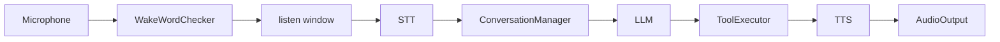
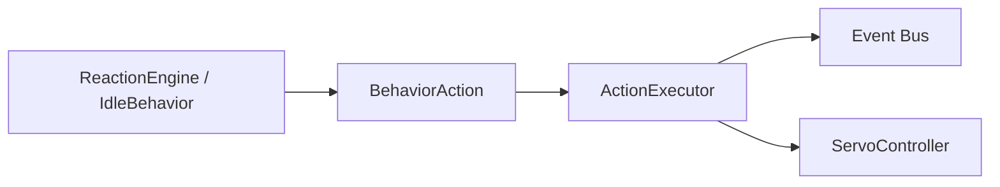

# Services

The `robot.services` package contains the integration services that glue
subsystems together at the application level.

---

## ConversationService

`ConversationService` (`robot.services.conversation_service`) is the single
integration point between audio I/O and the language-model pipeline:



### Pipeline

1. A `WakeWordChecker` analyses each audio chunk for wake-word triggers.
2. On detection, the robot transitions to `LISTENING`, buffers
   `listen_window_s` seconds of audio, then publishes `SpeechRecognized`.
3. The STT pipeline transcribes the audio.
4. `ConversationManager` sends the transcript + history to the LLM.
5. If the LLM responds with tool calls, `ToolExecutor` dispatches them and
   the LLM is re-called with the results (loop continues).
6. The TTS pipeline speaks the reply.
7. The state machine returns to `IDLE`.

When `wake_checker` is `None` the audio loop skips wake detection entirely —
the service only responds to `WakeWordDetected` events published by external
components (e.g. the MQTT bridge).

### Key dependencies

- `ConversationManager` — owns active conversation and message history.
- `ToolExecutor` — dispatches LLM tool calls to robot actions.
- `StateMachine` — tracks robot state transitions.
- `PreferenceTracker` — extracts user preferences from utterances.
- `Memory` / `VectorMemory` — provides recalled context for LLM prompts.

### Teaching & feedback wiring

When teaching mode is enabled, `ConversationService` carries optional
`feedback_service` and `teaching_controller` references:

- **Teaching instructions are parsed, not generated.** `_on_speech` first tries
  `teaching_controller.arm_from_instruction(text)` — the constrained
  `parse_teaching_instruction` parser (no LLM). On a match it acknowledges and
  returns without an LLM turn; a non-teaching utterance falls through to the
  normal conversation pipeline.
- **Spoken feedback is a side effect.** A static `_match_feedback` classifier
  (word/phrase lists, no LLM) detects praise ("good", "nice", "correct"…) or
  correction ("no", "wrong", "don't"…) and submits it to `FeedbackService`,
  which attributes it to the most-recent eligible real transition. The
  utterance still proceeds to the LLM normally. See
  [Teaching Mode](teaching_mode.md) for the full feedback semantics.

---

## ActionExecutor

`ActionExecutor` (`robot.services.executor`) translates `BehaviorAction`
value objects into bus events and servo commands. It is the boundary between
the behavior layer and concrete hardware outputs — **and the single point that
records real learning transitions** when a recorder is wired in.



### Supported actions

| Action | Dispatch |
|--------|----------|
| `RequestBlinkAction` | Publishes `BlinkRequested` |
| `RequestLookAction` | Publishes `LookRequested` |
| `RequestServoMoveAction` | Calls `ServoController.move_to()` + publishes `ServoMoved` |
| `RequestSleepAction` | Transitions state machine to `SLEEPING` |
| `LookAroundAction` | Sequences multiple `LookRequested` events |
| `CelebrateAction` | Emotion + servo celebration sequence |
| `WaveAction` | Drives the `right_arm` servo through a wave sequence |
| `MoveArmAction` | Moves a named arm servo (`left_arm`/`right_arm`) to a validated angle |
| `SpeakAction` | Synthesises + plays text via TTS (best-effort; no-op if TTS/audio missing, never a hardware failure) |
| `ChangeEmotionAction` | Publishes `EmotionChanged` (validates the emotion first) |
| `SetStateAction` | Publishes `StateChanged` directly (warns on illegal transitions) |

The executor depends on the `ServoController` protocol only; the concrete
backend (mock, GPIO, PCA9685) is injected at construction time. This makes the
wiring testable without hardware.

### Learning instrumentation

When an `ExperienceRecorder` is wired in, every executed action is wrapped in
the transition lifecycle so the learning system records a real experience:

```
recorder.begin_transition(action_index)      # snapshot state_t
  -> ActionExecutor._execute_one(action)   # drive hardware / bus
recorder.complete_transition(pending, ...)  # snapshot state_t+1, store Experience
```

The transition `metadata` carries the `behavior_action_name` plus any
`interaction_context.current_metadata()` — the `interaction_id`,
`teaching_session_id`, and `episode_id` that tag a teaching interaction (minted
by the `TeachingController`, not auto-minted per action). Outcomes are recorded
with `execution_success` / `execution_failure_reason` (e.g. an out-of-range arm
move is recorded as a *failed* transition, not a crash). The LLM tool layer's
learnable builtins are routed through this same `execute_one` path (see
[Tool Calling](tools.md)), so LLM tool calls also create transitions.

---

## MQTT bridge & Home Assistant

The MQTT bridge (`robot.services.mqtt_bridge`) and Home Assistant bridge
(`robot.services.home_assistant`) are also app-level services. See their
dedicated module docs:

- [MQTT Bridge](mqtt.md)
- [Home Assistant](home-assistant.md)
