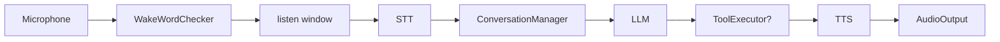
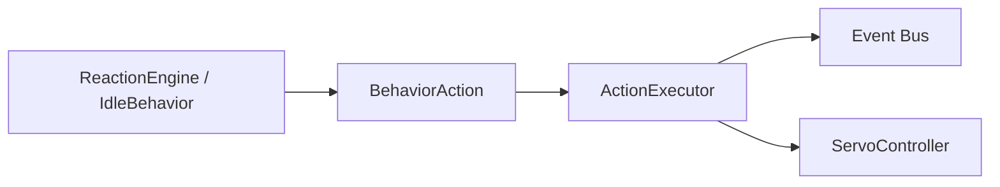

# Services

The `robot.services` package contains the integration services that glue
subsystems together at the application level.

---

## ConversationService

`ConversationService` (`robot.services.conversation_service`) is the single
integration point between audio I/O and the language-model pipeline:

### Pipeline

1. A `WakeWordChecker` analyses each audio chunk for wake-word triggers.
2. On detection, the robot transitions to `LISTENING`, buffers
   `listen_window_s` seconds of audio, then publishes `SpeechRecognized`.
3. The STT pipeline transcribes the audio.
4. `ConversationManager` sends the transcript + history to the LLM.
5. If the LLM responds with tool calls, `ToolExecutor` dispatches them and
   the LLM is re-called with the results (loop continues).
6. The TTS pipeline speaks the reply.
7. The state machine returns to `IDLE`.

When `wake_checker` is `None` the audio loop skips wake detection entirely —
the service only responds to `WakeWordDetected` events published by external
components (e.g. the MQTT bridge).

### Key dependencies

- `ConversationManager` — owns active conversation and message history.
- `ToolExecutor` — dispatches LLM tool calls to robot actions.
- `StateMachine` — tracks robot state transitions.
- `PreferenceTracker` — extracts user preferences from utterances.
- `Memory` / `VectorMemory` — provides recalled context for LLM prompts.

---

## ActionExecutor

`ActionExecutor` (`robot.services.executor`) translates `BehaviorAction`
value objects into bus events and servo commands. It is the boundary between
the behavior layer and concrete hardware outputs.

### Supported actions

| Action | Dispatch |
|--------|----------|
| `RequestBlinkAction` | Publishes `BlinkRequested` |
| `RequestLookAction` | Publishes `LookRequested` |
| `RequestServoMoveAction` | Calls `ServoController.move_to()` + publishes `ServoMoved` |
| `RequestSleepAction` | Transitions state machine to `SLEEPING` |
| `LookAroundAction` | Sequences multiple `LookRequested` events |
| `CelebrateAction` | Emotion + servo celebration sequence |

The executor depends on the `ServoController` protocol only; the concrete
backend (mock, GPIO, PCA9685) is injected at construction time. This makes the
wiring testable without hardware.

---

## MQTT bridge & Home Assistant

The MQTT bridge (`robot.services.mqtt_bridge`) and Home Assistant bridge
(`robot.services.home_assistant`) are also app-level services. See their
dedicated module docs:

- [MQTT Bridge](mqtt.md)
- [Home Assistant](home-assistant.md)
