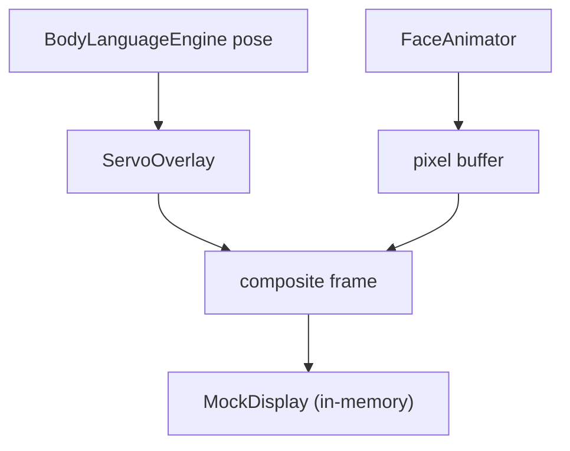

# Simulation

DeskBot provides a headless simulation driver that composes face rendering,
body pose, and a servo overlay without requiring physical hardware.

> See also the [Simulation reference](../reference/simulation.md) for the
> auto-generated API documentation.

---

## When to use simulation

- **Development**: iterate on face/body behavior without a Raspberry Pi.
- **CI**: run visual regression checks in headless environments.
- **Debugging**: inspect the composite frame buffer at any point.

---

## Running

```bash
make simulate
# or
deskbot-simulate
```

The simulation uses mock hardware backends for the display, servos, and
sensors. The face animator renders to an in-memory pixel buffer, and the
servo overlay draws a stick-figure body representation directly into that
buffer.

---

## Architecture



### SimulationDriver

`SimulationDriver` (`robot.simulation.driver`) owns the render loop:

1. Advance the `FaceAnimator` by one frame.
2. Read the current body `Pose` from the `BodyLanguageEngine`.
3. Composite the face frame with the `ServoOverlay`.
4. Push the composite to the `MockDisplay`.

### ServoOverlay

`ServoOverlay` (`robot.simulation.overlay`) draws a simple stick-figure body
(head + neck + two arms) into the face framebuffer, positioned according to the
current servo angles. The overlay uses the same pixel grid as the face, so
both render into a single display buffer.

---

## API reference

::: robot.simulation
    options:
      show_root_heading: true
      members: true
      show_if_no_docstring: true
