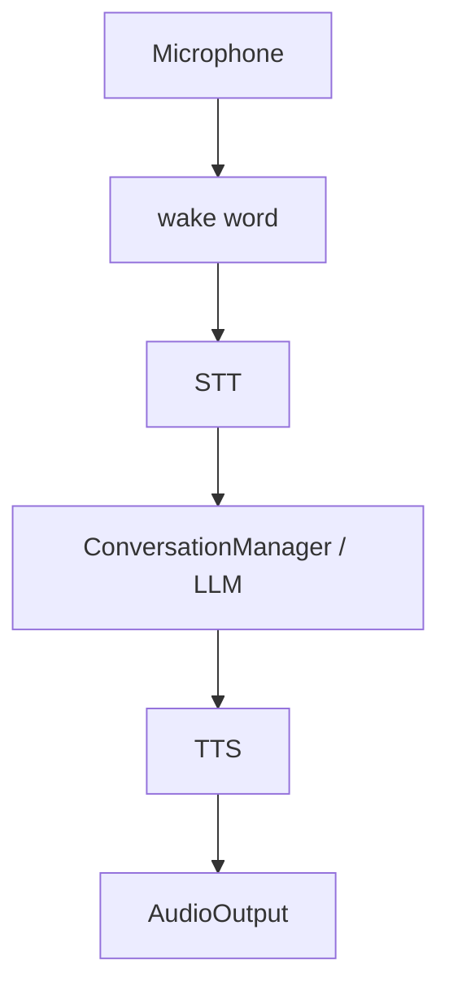

# Speech

The speech subsystem provides speech-to-text, text-to-speech, wake-word
detection, and sound effects.

## STT

The `SpeechToText` protocol is implemented by `MockSTT` and Whisper-based STT.

Configuration:

```env
DESKBOT_STT__PROVIDER=whisper
DESKBOT_STT__MODEL=base
DESKBOT_STT__LANGUAGE=en
```

The microphone abstraction supplies audio chunks independently of the STT
implementation.

## TTS

Available implementations include:

- `MockTTS`
- `OpenAITTS`
- `PiperTTS`
- `EspeakNGTTS`
- `ElevenLabsTTS`

Configuration:

```env
DESKBOT_TTS__PROVIDER=piper
DESKBOT_TTS__VOICE=default
DESKBOT_TTS__RATE=1.0
```

Piper-specific settings live below `DESKBOT_TTS__PIPER__...`.

## Wake word

Wake-word providers are selected with `DESKBOT_WAKEWORD__PROVIDER`:

- `mock` - auto-triggers after a few chunks; intended for tests, not production.
- `openwakeword` - model-based detection; the recommended production backend
  (requires the optional `openwakeword` dependency).
- `porcupine` - Picovoice Porcupine engine (requires `pvporcupine`).
- `snowboy` - Snowboy hotword engine (requires `snowboy`).

If the chosen backend's dependency or model is missing, DeskBot safely
degrades to no wake detection (`NullWakeWordChecker`) rather than waking on
any loud sound.

!!! warning "Energy is not a wake-word provider"

    An RMS/energy threshold is **not** a valid value for
    `DESKBOT_WAKEWORD__PROVIDER`. It was removed because loud audio is not a
    wake phrase (it would also trigger on DeskBot's own TTS output). Energy /
    volume detection is now a non-semantic *audio activity detector* (VAD),
    `robot.speech.wakeword_energy.EnergyActivityDetector`, used for low-level
    audio gating only, not for wake-word recognition. Selecting `"energy"` is a
    configuration validation error.

!!! warning "The openWakeWord phrase must match a loaded model"

    For `provider=openwakeword`, `DESKBOT_WAKEWORD__PHRASE` must name a model
    that openWakeWord actually loads, or point
    `DESKBOT_WAKEWORD__MODEL_PATH` at a custom `.onnx` model whose prediction
    key matches the phrase. The built-in models report scores for
    `hey_mycroft`, `hey_jarvis`, `hey_marvin`, `alexa`, `weather`, and the
    `*_timer` models. A phrase with no matching model (e.g. an arbitrary
    `"hey ron"` with no custom model) scores `0.0` on every frame, so the
    wake word **never triggers** -- silently. The checker logs a one-shot
    `openwakeword.phrase_not_found` WARNING naming the available models when
    this happens. Until a custom model is trained, set `PHRASE` to one of
    the built-in model names.

```env
DESKBOT_WAKEWORD__PROVIDER=openwakeword
DESKBOT_WAKEWORD__PHRASE=hey_mycroft
DESKBOT_WAKEWORD__THRESHOLD=0.5
# Optional custom openWakeWord ONNX model:
DESKBOT_WAKEWORD__MODEL_PATH=
```

## Conversation audio loop

The conversation service coordinates:



Events provide the integration points for the behavior and face systems.

## Audio output

Real output implementations currently include USB and Bluetooth speakers,
alongside the mock backend.

Sound effects are loaded from the project's assets and publish
`SoundEffectPlayed` events when played.

## Sound effects & automatic reactions

`SoundEffectsPlayer` (`robot.speech.sound_effects`) loads the WAV files in
`assets/sounds/`. The files are named
`<id>__<author>__small-robot-<sound>[-<n>].wav`; the player normalises them
to the semantic sound name (the suffix after `-robot-`, with the trailing
`-<n>` variant stripped), so `...-robot-talk-1.wav` … `talk-4.wav` are all
exposed as `talk`, and `...-robot-very-cute.wav` as `very-cute`.

Available sounds: `angry`, `confused`, `cute`, `surprise`, `talk`,
`thinking`, `very-cute` (with random variation across numbered variants).

The `SoundReactor` (`robot.behavior.sound_reactor`) makes the robot
**automatically use** these sounds by subscribing to the event bus:

| Trigger                         | Sound        |
|---------------------------------|--------------|
| `EmotionChanged` -> `ANGRY`      | `angry`      |
| `EmotionChanged` -> `SURPRISED`  | `surprise`   |
| `EmotionChanged` -> `HAPPY`      | `cute`       |
| `EmotionChanged` -> `EXCITED`    | `very-cute`  |
| `EmotionChanged` -> `EMBARRASSED`| `confused`   |
| `StateChanged` -> `THINKING`     | `thinking`   |

Unmapped emotions/states stay silent, and a sound is only played when its
WAV actually exists (`has_sound`), so the reactor never raises. The `talk`
sounds are intentionally **not** auto-played because they would clash with
TTS speech on the same audio output; they remain available via the REST API
(`POST /api/v1/settings/sound-effect/{name}`) and the LLM `play_sound` tool.

```env
DESKBOT_SOUNDS__ENABLED=true
DESKBOT_SOUNDS__VOLUME=0.8
DESKBOT_SOUNDS__REACTIONS_ENABLED=true   # auto-play on emotions/state
```

Set `DESKBOT_SOUNDS__REACTIONS_ENABLED=false` to keep manual/API-only sound
effects while disabling the automatic reactions.
