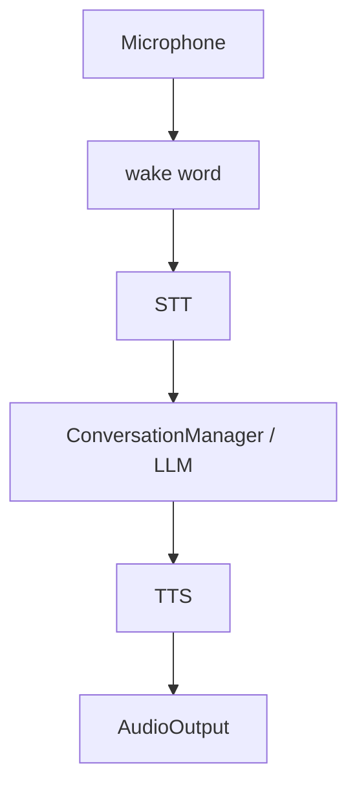

# Speech

The speech subsystem provides speech-to-text, text-to-speech, wake-word
detection, and sound effects.

## STT

The `SpeechToText` protocol is implemented by `MockSTT` and Whisper-based STT.

Configuration:

```env
DESKBOT_STT__PROVIDER=whisper
DESKBOT_STT__MODEL=base
DESKBOT_STT__LANGUAGE=en
```

The microphone abstraction supplies audio chunks independently of the STT
implementation.

## TTS

Available implementations include:

- `MockTTS`
- `OpenAITTS`
- `PiperTTS`
- `EspeakNGTTS`

Configuration:

```env
DESKBOT_TTS__PROVIDER=piper
DESKBOT_TTS__VOICE=default
DESKBOT_TTS__RATE=1.0
```

Piper-specific settings live below `DESKBOT_TTS__PIPER__...`.

## Wake word

Wake-word providers currently include:

- `mock`
- `energy`
- `openwakeword`

Porcupine and Snowboy are reserved configuration values but are not current
providers.

Energy detection uses RMS audio level rather than speech recognition. It is
therefore a sound trigger, not a semantic understanding of the phrase.

```env
DESKBOT_WAKEWORD__PROVIDER=energy
DESKBOT_WAKEWORD__PHRASE=hey deskbot
DESKBOT_WAKEWORD__ENERGY_THRESHOLD=0.05
DESKBOT_WAKEWORD__ENERGY_COOLDOWN_S=1.5
```

## Conversation audio loop

The conversation service coordinates:



Events provide the integration points for the behavior and face systems.

## Audio output

Real output implementations currently include USB and Bluetooth speakers,
alongside the mock backend.

Sound effects are loaded from the project's assets and publish
`SoundEffectPlayed` events when played.

## Sound effects & automatic reactions

`SoundEffectsPlayer` (`robot.speech.sound_effects`) loads the WAV files in
`assets/sounds/`. The files are named
`<id>__<author>__small-robot-<sound>[-<n>].wav`; the player normalises them
to the semantic sound name (the suffix after `-robot-`, with the trailing
`-<n>` variant stripped), so `...-robot-talk-1.wav` … `talk-4.wav` are all
exposed as `talk`, and `...-robot-very-cute.wav` as `very-cute`.

Available sounds: `angry`, `confused`, `cute`, `surprise`, `talk`,
`thinking`, `very-cute` (with random variation across numbered variants).

The `SoundReactor` (`robot.behavior.sound_reactor`) makes the robot
**automatically use** these sounds by subscribing to the event bus:

| Trigger                         | Sound        |
|---------------------------------|--------------|
| `EmotionChanged` -> `ANGRY`      | `angry`      |
| `EmotionChanged` -> `SURPRISED`  | `surprise`   |
| `EmotionChanged` -> `HAPPY`      | `cute`       |
| `EmotionChanged` -> `EXCITED`    | `very-cute`  |
| `EmotionChanged` -> `EMBARRASSED`| `confused`   |
| `StateChanged` -> `THINKING`     | `thinking`   |

Unmapped emotions/states stay silent, and a sound is only played when its
WAV actually exists (`has_sound`), so the reactor never raises. The `talk`
sounds are intentionally **not** auto-played because they would clash with
TTS speech on the same audio output; they remain available via the REST API
(`POST /api/v1/settings/sound-effect/{name}`) and the LLM `play_sound` tool.

```env
DESKBOT_SOUNDS__ENABLED=true
DESKOT_SOUNDS__VOLUME=0.8
DESKBOT_SOUNDS__REACTIONS_ENABLED=true   # auto-play on emotions/state
```

Set `DESKBOT_SOUNDS__REACTIONS_ENABLED=false` to keep manual/API-only sound
effects while disabling the automatic reactions.
