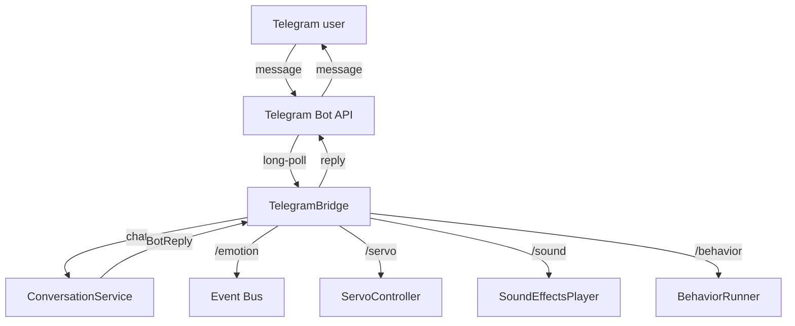

# Telegram Bridge

DeskBot can be controlled from Telegram. The Telegram bridge lets you chat
with the robot (messages go through the full LLM → TTS pipeline) and control
every aspect via slash commands.

---

## Overview

The bridge runs a long-poll loop against the Telegram Bot API. When a message
arrives it is dispatched to:

- **Chat** — plain text is forwarded to `ConversationService.handle_user_text`,
  which runs the LLM conversation pipeline. The reply is sent back to Telegram.
- **Slash commands** — structured commands for direct control.

The bridge also subscribes to `BotReply` events, so when a reply is produced
from any input source (voice, API, MQTT, or Telegram itself), it is forwarded
to all pending Telegram chats.

---

## Configuration

Telegram is **opt-in** and disabled by default:

```bash
DESKBOT_TELEGRAM__ENABLED=true
DESKBOT_TELEGRAM__BOT_TOKEN=123456:ABC-DEF...
DESKBOT_TELEGRAM__ALLOWED_USER_IDS=[123456789]
```

| Variable | Default | Description |
|----------|---------|-------------|
| `DESKBOT_TELEGRAM__ENABLED` | `false` | Enable or disable the Telegram bridge |
| `DESKBOT_TELEGRAM__BOT_TOKEN` | `""` | Bot token from `@BotFather` |
| `DESKBOT_TELEGRAM__ALLOWED_USER_IDS` | `[]` | If non-empty, only these Telegram user IDs may interact |
| `DESKBOT_TELEGRAM__CHAT_TIMEOUT_S` | `60.0` | Seconds to wait for a BotReply event |
| `DESKBOT_TELEGRAM__API_BASE` | `https://api.telegram.org` | API base URL (for self-hosted instances) |

Create a bot by talking to `@BotFather` on Telegram to get a token.

---

## Commands

### Chat

Send any plain text message — it goes through the full conversation pipeline
(STT → LLM → TTS → state transitions), exactly like a spoken utterance. Because
text is published as a `SpeechRecognized` event, it also flows through the
teaching-aware path: when teaching mode is enabled, a chat message can arm a
`"when I {gesture}, {action}"` session or be read as praise/correction. See
[Teaching Mode](teaching_mode.md).

### Slash commands

| Command | Arguments | Description |
|---------|-----------|-------------|
| `/emotion` | `<name> [intensity]` | Set the robot's emotion |
| `/state` | `<name>` | Change the robot's state |
| `/speak` | `<text>` | Speak via TTS (bypasses LLM) |
| `/servo` | `<name> <angle> [duration_s]` | Move a servo |
| `/sound` | `<name>` | Play a sound effect (use alone to list) |
| `/behavior` | `<name>` | Play a behavior sequence |
| `/status` | — | Show current robot status |
| `/config` | `[key]` | Show configuration (sensitive values masked) |
| `/help` | — | Show help message |

#### Emotions

`neutral`, `happy`, `curious`, `thinking`, `sleepy`, `embarrassed`, `excited`, `sad`, `surprised`, `angry`

#### States

`boot`, `idle`, `curious`, `listening`, `thinking`, `speaking`, `sleeping`, `error`

#### Behaviors

`greeting`, `thinking`, `listening`, `sleeping`, `excited`, `surprised`

---

## Security

The `allowed_user_ids` setting restricts who can interact with the bot. If the
list is non-empty, only those Telegram user IDs are accepted. All other users
receive a "not authorised" message.

Configuration values shown via `/config` have sensitive fields (`bot_token`,
`api_key`) masked with `***`.

---

## Installation

```bash
pip install deskbot[telegram]
```

The Telegram bridge uses `httpx` for HTTP calls to the Telegram Bot API. If
`httpx` is not installed and Telegram is enabled, DeskBot logs a warning and
continues without the bridge.

---

## Architecture



The bridge is wired into `DeskBotApp` via `_on_startup` / `_on_shutdown`,
following the same pattern as the MQTT and Home Assistant bridges.
